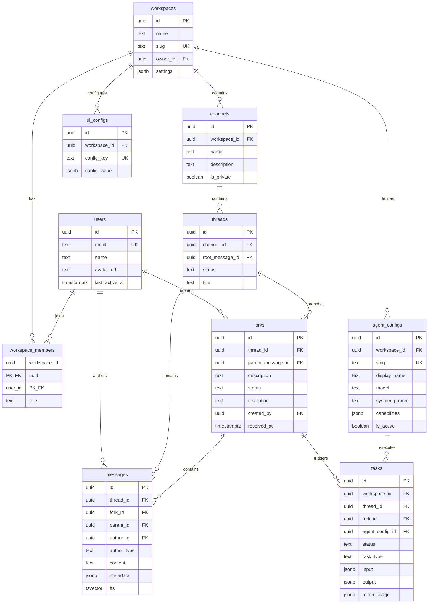

# MVP Design Synthesis

> **Updated 2026-02-08:** Terminology changed from Fork/Resolve to Deep Dive/Publish per PRODUCT-CORE-REFRAME.md

> Status: Complete | Author: mvp-synthesizer | Date: 2026-02-07
> Primary input: Phase 1 SYNTHESIS.md + 9 Phase 1.5 research documents
> Purpose: Definitive reference for Sprint 0 implementation

> **REFRAME NOTICE (2026-02-07):** The "fork/resolve" framing throughout this document reflects a concept drift.
> The product core is **AI Deep Dive**: one person deep dives with AI on a conversation point → AI compresses
> the output → structured result flows to the team thread with progressive disclosure. The mechanism (side-context
> → structured output → main thread) is the same, but the mental model, AI role, and value proposition are
> different. Where this doc says "fork," read "deep dive." Where it says "resolve," read "publish."
> See [`docs/design/PRODUCT-CORE-REFRAME.md`](../../design/PRODUCT-CORE-REFRAME.md) for full reframe.

---

## 1. Executive Summary

**What:** OpenVibe is an AI-native team collaboration platform that replaces Slack for the Vibe team (20 users). Its core differentiator is the **fork/resolve thread model** -- users fork side-discussions from any message, explore with AI agents, then resolve back to the main thread with an AI-generated summary.

**Who:** The Vibe team (20 people). Internal dogfood only. No external users, no verticals, no mobile.

**Why:** Slack's linear threads bury decisions in noise. AI bolt-ons (Slack AI, ChatGPT branching) treat AI as a feature, not a structural element. OpenVibe makes AI a first-class participant in a conversation structure designed for exploration and convergence.

**When:** 8 weeks (4 sprints of 2 weeks). Sprint 0 (2-3 days) for infrastructure. Dogfood launch at Week 8.

**How much:** ~$640-940/month total infrastructure + LLM cost. $15/mo Fly.io, $25/mo Supabase Pro, $600-900/mo Anthropic API. LLM tokens are 87% of total cost.

**Strategic thesis:** The durable moat is behavioral (fork/resolve habits) + data (accumulated memory), not technical. The technical infrastructure will be commoditized in 2-3 years. Win by shipping fast, validating the interaction pattern, and accumulating switching costs.

---

## 2. Product Definition

### 2.1 Core User Flows

1. **Post and discuss in channels.** User posts a message in a channel, creating a thread. Team members reply. Messages appear in real-time via Supabase Realtime. Markdown renders with syntax highlighting.

2. **Ask an AI agent.** User types `@Vibe what is our deployment timeline?` in any thread or fork. The system detects the @mention, creates a task, calls Claude, and posts the response as a message with distinct agent styling. A "thinking" indicator shows while the agent processes.

3. **Fork a side-discussion.** User clicks "Fork" on any message. A new fork is created with an auto-generated description. The user works in the fork (posting messages, @mentioning agents) while the main thread continues undisturbed. The fork sidebar shows all active forks for the thread.

4. **Resolve a fork.** User clicks "Resolve" in a fork. An AI generates a structured summary (headline + bullet points). The user reviews, optionally edits, and posts the summary to the main thread. The fork is archived. Other thread participants see only the conclusion, not the 20-message research process.

5. **Search past discussions.** User opens search (Cmd+K), types a query, sees results ranked by relevance with highlighted matches. Clicking a result navigates to the message in its thread context.

### 2.2 What the User Sees

**Discord-like 4-zone layout:**

```
┌──────────┬──────────────────────────┬──────────────┐
│ Channel  │                          │ Fork         │
│ Sidebar  │   Main Content Area      │ Sidebar      │
│ (240px)  │                          │ (320px,      │
│          │   Thread list OR         │  conditional)│
│ - #gen   │   Thread view OR         │              │
│ - #eng   │   Fork view              │ Active (2)   │
│ - #prod  │                          │ - Research   │
│ - #rand  │   Messages render with   │ - Testing    │
│          │   human/agent styling    │              │
│          │                          │ Resolved (1) │
│ Agents   │   ComposeBox at bottom   │ - Auth Impl  │
│ - @Vibe  │                          │              │
│ - @Coder │                          │              │
└──────────┴──────────────────────────┴──────────────┘
```

- **Focus Mode:** One context at a time. Clicking a fork in the sidebar switches the main content area. No tabs. Fork selection is client-side Zustand state (not URL route) for instant switching.
- **Progressive Disclosure:** Agent responses >500 words show headline + summary + expandable full output. Short responses display fully.
- **Agent styling:** Agent messages have distinct avatar, subtle background color, and "AI" badge. System messages (fork resolutions) render as compact information blocks.

### 2.3 What is NOT in MVP

| Feature | Why Not | Revisit When |
|---------|---------|--------------|
| Mobile UI | Desktop-first, Vibe team uses desktops | User demand |
| Notifications (email/push) | Use existing Slack for urgent items during transition | Team misses important messages |
| File attachments | Share via Google Drive, paste links | Week 5+ if requested |
| Reactions/emoji | Reply with text acknowledgment | Week 5+ if requested |
| DMs / private channels | All 20 users on same team, all channels public | Team requests privacy |
| Agent Teams / multi-agent | Single-agent per @mention | Agent quality validated |
| Admin console UI | YAML + Supabase dashboard | Pre-vertical expansion |
| Branch visualization (git graph) | Forks shown in sidebar list, not graph | Never (rejected by R1) |
| Diff view between forks | Unnecessary complexity | Never (rejected by R1) |
| Nested forks (fork from fork) | Creates Reddit-like confusion | Dogfood validates need |
| Cross-runtime context | OpenClaw keeps its own context | Phase 4-5 |
| Self-hosted deployment | Cloud-only via Supabase + Fly.io | Customer demand |
| Plugin/extension API | No external developers | Vertical expansion |
| Offline support | Internet always available | Construction vertical |
| Unread tracking | Scroll to bottom; search if missed | Team complains |
| User presence (online/offline) | Post when you're around | Scale >50 users |

### 2.4 Success Metrics

| Metric | Target | Kill Signal |
|--------|--------|-------------|
| Daily active users | >15 of 20 after 2 weeks | <5 after 2 weeks |
| Forks created per week | >10 | 0 after 4 weeks |
| Forks resolved (not abandoned) | >50% of created forks | <20% resolved |
| Agent invocations per day | >20 | <5 |
| Resolution summary approval | >75% (thumbs up/down) | <60% |
| Slack revert rate | <30% of conversations still in Slack after 4 weeks | >70% still in Slack |

---

## 3. Architecture Overview

### 3.1 Architecture Diagram

```
                      ┌──────────────────────────────────────────┐
                      │             INTERNET                       │
                      └───────────────────┬──────────────────────┘
                                          │ HTTPS
                     ┌────────────────────▼────────────────────────┐
                     │              Fly.io (Single Region)           │
                     │                                               │
                     │  ┌──────────────────────────────────────┐    │
                     │  │       Next.js Application              │    │
                     │  │       (1 Machine, shared-cpu-2x, 1GB)  │    │
                     │  │                                        │    │
                     │  │  ┌──────────────┐  ┌───────────────┐  │    │
                     │  │  │  SSR + Static │  │  tRPC API     │  │    │
                     │  │  │  (React)     │  │  ~30 procs    │  │    │
                     │  │  └──────────────┘  └──────┬────────┘  │    │
                     │  │                           │           │    │
                     │  │  ┌────────────────────────▼────────┐  │    │
                     │  │  │  Agent Task Processor            │  │    │
                     │  │  │  (in-process, fire-and-forget)   │  │    │
                     │  │  │  - @mention handler              │  │    │
                     │  │  │  - Fork resolution handler       │  │    │
                     │  │  └─────────┬──────────────┬────────┘  │    │
                     │  └────────────┼──────────────┼───────┘    │
                     └───────────────┼──────────────┼────────────┘
                                     │              │
                        ┌────────────┘              └──────────┐
                        ▼                                      ▼
             ┌──────────────────┐                    ┌──────────────┐
             │   Supabase Pro   │                    │  Anthropic   │
             │   (managed)      │                    │  API         │
             │                  │                    │              │
             │  PostgreSQL      │◄─── Browser ──────►│  Claude      │
             │  + pgvector      │  (direct WSS)      │  Sonnet 4.5  │
             │  + tsvector      │                    │  Haiku 4.5   │
             │  Realtime (WSS)  │                    │  Opus 4.6    │
             │  Auth (OAuth)    │                    └──────────────┘
             │  Storage (S3)    │
             └──────────────────┘
```

Key architectural properties:
- **Single deployable.** One Next.js app on one Fly.io Machine handles SSR, API, and agent processing.
- **Database-mediated agent coupling.** Thread engine writes task rows. Agent processor reads them. They share no direct interface. Agent can be extracted to a separate worker with zero API changes.
- **Browser connects to Supabase Realtime directly.** The app server never proxies WebSocket connections. Server restarts do not drop real-time connections.
- **No Redis, no queue, no separate workers, no CDN.** 20 users do not justify infrastructure complexity.

### 3.2 Tech Stack

| Component | Choice | Rationale |
|-----------|--------|-----------|
| **Framework** | Next.js 14 (App Router) | SSR + API routes in one app. Standard ecosystem. |
| **Styling** | TailwindCSS + shadcn/ui | Utility-first. shadcn = copy-paste components, not a dependency. |
| **State** | Zustand (7 stores) | Simpler than Redux. Independent stores prevent monolith. |
| **API** | tRPC | End-to-end TypeScript types. Zero schema overhead. |
| **Database** | Supabase Pro (PostgreSQL + pgvector) | Realtime, Auth, Storage included. One managed dependency. |
| **Real-time** | Supabase Realtime (postgres_changes) | Automatic broadcast on INSERT/UPDATE. No custom WebSocket server. |
| **Auth** | Supabase Auth (email + Google OAuth) | Built-in, no custom auth server. JWT-based. |
| **Search** | PostgreSQL tsvector + GIN | Generated column, auto-indexed. Handles millions of docs. |
| **LLM** | Anthropic API (direct calls) | Sonnet 4.5 for agents, Haiku 4.5 for summaries/classification. |
| **Hosting** | Fly.io (single Machine) | No timeout limits. WebSocket support. Docker portable. |
| **Monorepo** | Turborepo or Nx | Package structure enables parallel development. Decide at setup. |
| **Testing** | Vitest (unit/integration) + Playwright (E2E) | Standard Next.js testing stack. |
| **CI/CD** | GitHub Actions + Fly.io deploy | Lint + typecheck + build gate. Auto-deploy on push to main. |

### 3.3 Infrastructure and Cost

| Component | Service | Spec | Monthly Cost |
|-----------|---------|------|-------------|
| Application server | Fly.io Machine | shared-cpu-2x, 1GB RAM | ~$15 |
| Database + Auth + Realtime + Storage | Supabase Pro | 8GB DB, 250GB bandwidth | $25 |
| LLM API | Anthropic | Sonnet/Haiku (~50 tasks/day) | $600-900 |
| DNS + SSL | Fly.io (included) | Automatic | $0 |
| **Total** | | | **$640-940/month** |

LLM tokens are 87% of total cost. Infrastructure optimization (fancy session management, auto-scaling) saves $20/month. LLM optimization (model routing, prompt caching, context trimming) saves $300/month. Optimize the right thing.

---

## 4. Data Model

### 4.1 Table Summary

| # | Table | Purpose | Key Columns | Row Count (dogfood) |
|---|-------|---------|-------------|-------------------|
| 1 | `workspaces` | Multi-tenant boundary | id, name, slug, owner_id, settings | 1 |
| 2 | `users` | User identity | id, email, name, avatar_url, last_active_at | ~20 |
| 3 | `workspace_members` | Membership + roles | workspace_id, user_id, role (admin/member) | ~20 |
| 4 | `channels` | Topic containers | id, workspace_id, name, description, is_private | ~10 |
| 5 | `threads` | Conversation containers | id, channel_id, root_message_id, status, title | ~500/month |
| 6 | `forks` | Side-discussions | id, thread_id, parent_message_id, status, resolution | ~50/month |
| 7 | `messages` | The core data unit | id, thread_id, fork_id, author_id, author_type, content, fts | ~5000/month |
| 8 | `tasks` | Agent task queue | id, thread_id, agent_config_id, status, token_usage | ~1000/month |
| 9 | `agent_configs` | Agent definitions | id, workspace_id, slug, display_name, model, system_prompt | 3 |
| 10 | `ui_configs` | Admin UI config (JSONB) | id, workspace_id, config_key, config_value | ~10 |
| 11 | `api_keys` | External auth (future) | id, workspace_id, key_hash, permissions | 0 (dogfood) |
| 12 | `context_items` | Future context bus | id, workspace_id, type, content, embedding, fts | 0 (dogfood) |

### 4.2 ER Diagram



### 4.3 Key Relationships

- **Messages belong to a thread, optionally to a fork.** `fork_id = NULL` means main thread. This allows a single per-thread Supabase Realtime subscription to capture all messages (main + all forks), with client-side filtering by `fork_id`.
- **Forks reference a parent message.** The fork point is a message in the main thread, providing context for the fork.
- **Tasks reference both thread and fork.** The agent needs to know which context to assemble (main thread vs fork).
- **Full-text search is automatic.** The `fts` column on messages is `GENERATED ALWAYS AS (to_tsvector('english', content)) STORED`. No indexing pipeline.
- **Fork resolution creates a message.** When resolved, a new message is inserted in the main thread (`fork_id = NULL`) with `metadata.isResolution = true` and `metadata.resolvedForkId`.

---

## 5. Key Design Decisions

| # | Decision | Choice | Why | Source |
|---|----------|--------|-----|--------|
| 1 | Thread model | Fork/Resolve (not branch/merge) | Simpler than Git semantics. No product has succeeded with full Git-like conversation branching. Fork/resolve is the minimum viable differentiation. | R1, SYNTHESIS |
| 2 | Hosting | Fly.io (not Vercel) | Vercel serverless functions timeout at 60-800s. Agent tasks need 10-120s of streaming. Fly.io has no timeout limits, native WebSocket support, and Docker portability. | system-architect |
| 3 | Agent roster | 2+1 (not 4-5) | @Vibe (general) + @Coder (code) + Fork Resolver (system). Two choices are learnable in a day. Five choices create decision paralysis. Add based on usage data. | agent-designer |
| 4 | Agent definition | Database record seeded from YAML (not running process) | An agent is a system_prompt + model + capabilities. The runtime is separate infrastructure. This separation is critical for simplicity and scalability. | agent-designer |
| 5 | Personality model | Single `system_prompt` text field | Structured fields (tone dropdown, verbosity slider) produce worse results than well-written prose. OpenClaw's SOUL.md proves this. | agent-designer |
| 6 | Fork context | Parent message + fork messages only (NOT full parent thread) | Fork is a focused side-discussion. Loading 200 parent thread messages into a 10-message fork dilutes agent focus. | agent-designer |
| 7 | Fork navigation | Zustand state (not URL routes) | Instant switching without route transition overhead. Fork selection is lost on page reload (acceptable for MVP). | frontend-architect |
| 8 | Fork depth | Hard limit = 1 (no nested forks) | Avoids Reddit-like confusion. Forking from a resolved fork creates a NEW top-level fork. | thread-ux-designer |
| 9 | Max active forks | 7 per thread (configurable) | Cognitive limit. Needs dogfood validation. | thread-ux-designer |
| 10 | Notification default | Conclusions-only (not activity-based) | Opposite of Slack's default. Fork activity is noise; resolution summaries are signal. | thread-ux-designer |
| 11 | Progressive disclosure | 3 layers (headline / summary / full) | Prevents information overload. Post-processing with Haiku generates summary from full output. | thread-ux-designer |
| 12 | Agent task queue | Postgres tasks table (not Redis) | Sufficient at 20 users. No queue infrastructure needed. Fire-and-forget from tRPC mutation handler. | backend-architect, system-architect |
| 13 | Real-time | Supabase Realtime only (no custom WebSocket) | Already in stack. Per-thread subscriptions. Browser connects directly to Supabase. | system-architect |
| 14 | Search | PostgreSQL tsvector + GIN (no external engine) | Handles millions of docs. Auto-indexed via generated column. No Elasticsearch needed. | backend-architect |
| 15 | Agent streaming | No streaming for MVP (full response then post) | Simpler implementation. "Agent is thinking" indicator covers the wait. Add streaming in Phase 4. | system-architect |
| 16 | Per-user runtime | Per-request context hydration (not persistent sessions) | 20 users with forum latency. A `getUserRuntime()` function call is sufficient. Save session management for 50+ users. | runtime-architect |
| 17 | ORM | None for dogfood (raw SQL + Supabase client) | 10 tables do not need an ORM. Add Drizzle at 20+ tables. | system-architect |
| 18 | Admin config | YAML seed + `ui_configs` table + simple settings page | No admin console. Admin uses a minimal settings page for agent management. Full admin console is Phase 5+. | admin-ui-designer |
| 19 | Agent response components | 7 MVP types | text, table, action_buttons, summary_card, confirmation, progress, form. Covers all dogfood scenarios. | admin-ui-designer |
| 20 | License | AGPL-3.0 (recommended, decide before public release) | Code auditability for trust-sensitive industries. Revenue from managed service. | thesis-analyst, SYNTHESIS |
| 21 | Subscription granularity | Per-thread (not per-fork, not per-workspace) | All fork messages share `thread_id`. One subscription captures all activity. Client filters by `fork_id`. | frontend-architect |
| 22 | Agents create forks | No (agents suggest, humans create) | Prevents runaway fork creation. Auto-forking deferred until dogfood validates the pattern. | thread-ux-designer |
| 23 | Agent tools/MCP | None for MVP (text-only output) | Safest starting point. No tool access = no risk. MCP integration is Phase 4. | agent-designer |

---

## 6. Subsystem Specifications

### 6.1 Thread Engine

| Property | Detail |
|----------|--------|
| **Purpose** | Manages channels, threads, forks, messages, and resolution. This IS the product. |
| **Key interfaces** | `ChannelService`, `ThreadService`, `ForkService`, `MessageService` |
| **Data owned** | `channels`, `threads`, `forks`, `messages` |
| **MVP scope** | Channel CRUD, thread CRUD with cursor pagination, fork lifecycle (create/resolve/abandon), message send with @mention detection, markdown rendering |
| **Not in MVP** | Nested forks, thread auto-summarization, reaction support, unread tracking |
| **Critical coupling** | Writes task rows for agent-runtime (async, database-mediated). Never calls agent-runtime directly. |
| **Reference** | BACKEND-MINIMUM-SCOPE.md (tRPC routers), THREAD-UX-PROPOSAL.md (fork lifecycle) |

### 6.2 Agent Runtime

| Property | Detail |
|----------|--------|
| **Purpose** | Executes AI tasks: @mention responses, fork resolutions, thread summaries. |
| **Key interfaces** | `AgentRuntime`, `TaskQueue`, `TaskProcessor`, `ContextBuilder`, `LLMProvider` |
| **Data owned** | `tasks`, `agent_configs` |
| **MVP scope** | Direct Anthropic API calls (no SDK). Fire-and-forget processing. 4-state task lifecycle (queued/running/completed/failed). Context: last 50 thread messages + system prompt. Retry: 3 attempts with exponential backoff. |
| **Not in MVP** | Agent streaming, Claude Code SDK integration, MCP tools, multi-agent coordination, agent memory |
| **Critical coupling** | Reads task rows written by thread-engine. Writes response messages to messages table. Supabase Realtime broadcasts to clients. |
| **Reference** | AGENT-DEFINITION-MODEL.md, RUNTIME-ARCHITECTURE.md |

### 6.3 Auth & Identity

| Property | Detail |
|----------|--------|
| **Purpose** | Manages who can do what. Users, workspaces, membership, sessions, permissions. |
| **Key interfaces** | `AuthService`, `WorkspaceService`, `PermissionMiddleware` |
| **Data owned** | `users`, `workspaces`, `workspace_members`, `api_keys` |
| **MVP scope** | Supabase Auth (email + Google OAuth). 2 roles (admin/member). RLS for workspace isolation. tRPC middleware for permission checks. Service role key for agent writes. |
| **Not in MVP** | SAML/SSO, advanced RBAC, audit logging, data export/GDPR, multiple workspaces per user |
| **Critical coupling** | Cross-cutting middleware. All other subsystems enforce permissions through auth middleware and RLS, not explicit calls. |
| **Reference** | BACKEND-MINIMUM-SCOPE.md (RLS policies), M6-AUTH.md |

### 6.4 Config System

| Property | Detail |
|----------|--------|
| **Purpose** | Admin controls for workspace configuration. The mechanism by which one codebase serves different use cases. |
| **Key interfaces** | `ConfigService`, `useConfig()` hook, CSS custom properties |
| **Data owned** | `ui_configs` |
| **MVP scope** | Simple key-value store (JSONB). Config keys: sidebar_layout, theme, max_forks_per_thread, default_agent, features. `useConfig()` hook + `useTerminology()` hook in frontend. CSS custom properties for branding. |
| **Not in MVP** | 4-layer config inheritance, visual layout builder, config migration, template marketplace |
| **Critical coupling** | Leaf subsystem. Only auth depends on it (admin checks). Thread engine and frontend read config but do not depend on config logic. |
| **Reference** | ADMIN-CONFIGURABLE-UI.md (config schema, CSS custom properties) |

### 6.5 Real-time Layer

| Property | Detail |
|----------|--------|
| **Purpose** | Delivers live updates to connected clients. Messages, fork status, task status, typing indicators. |
| **Key interfaces** | `useThreadSubscription`, `useChannelSubscription`, `useTypingIndicator`, `useRealtimeHealth` (custom React hooks) |
| **Data owned** | None. Broadcasts changes from tables owned by other subsystems. |
| **MVP scope** | 9 event types: message.created/updated/deleted, fork.created/resolved/abandoned, task.status_changed, thread.updated, typing.indicator. Per-thread subscriptions. Typing via Supabase Broadcast (ephemeral). |
| **Not in MVP** | Custom WebSocket server, per-workspace subscriptions, SSE for agent streaming |
| **Critical coupling** | Entirely implicit. No subsystem explicitly invokes it. Supabase Realtime fires automatically on database changes. Requires publication configuration: `ALTER PUBLICATION supabase_realtime ADD TABLE messages, forks, tasks, threads;` |
| **Reference** | SYSTEM-ARCHITECTURE.md (WebSocket architecture), FRONTEND-ARCHITECTURE.md (subscription hooks) |

### 6.6 Search

| Property | Detail |
|----------|--------|
| **Purpose** | Find messages by content across all channels and threads. |
| **Key interfaces** | `SearchService` (one procedure: `search.messages`) |
| **Data owned** | The `fts` generated column on `messages` + GIN index. No separate table. |
| **MVP scope** | Workspace-wide full-text search. Optional channel filter. Results ranked by `ts_rank` with `ts_headline` highlights. ~20 results per query. |
| **Not in MVP** | Semantic/vector search, search suggestions, saved searches, search analytics |
| **Critical coupling** | Direct Postgres tsvector query. RLS ensures workspace isolation. No event-driven behavior. |
| **Reference** | BACKEND-MINIMUM-SCOPE.md (search implementation) |

### 6.7 Storage Layer

| Property | Detail |
|----------|--------|
| **Purpose** | Abstracts database and file storage access. Centralizes Supabase client configuration. |
| **Key interfaces** | `DatabaseClient` (userClient + serviceClient), `MigrationRunner`, `FileStorage` |
| **Data owned** | All tables (underlying store). Data semantics owned by subsystems above. |
| **MVP scope** | Two Supabase clients: userClient (RLS-enforced) and serviceClient (bypasses RLS for agent writes). SQL migration files. No ORM. |
| **Not in MVP** | Drizzle ORM, automated migration tooling, read replicas, Redis cache |
| **Critical coupling** | `packages/db` is the ONLY package that imports `@supabase/supabase-js`. All other packages access DB through this package. |
| **Reference** | SYSTEM-ARCHITECTURE.md (storage strategy, monorepo structure) |

---

## 7. Implementation Plan

### 7.1 Sprint Plan

| Sprint | Duration | Goal | Key Deliverables |
|--------|----------|------|-----------------|
| **Sprint 0** | 2-3 days | Deployable empty shell | Monorepo scaffold, Supabase project, all 10 tables + RLS + Realtime publication, tRPC scaffold, Fly.io deploy, GitHub Actions CI, seed data (workspace, 4 channels, 3 agents) |
| **Sprint 1** | Weeks 1-2 | Users chat in channels with real-time sync | Signup/login (email + Google OAuth), workspace creation/invitation, channel CRUD, message posting, Supabase Realtime subscriptions, markdown rendering. **Invite 2-3 users for testing.** |
| **Sprint 2** | Weeks 3-4 | Users get AI responses in threads | Thread panel (Discord-like side panel), thread replies, multi-participant threads, @mention detection + agent invocation, agent response rendering, "thinking" indicator. **Invite 5-8 users.** |
| **Sprint 3** | Weeks 5-6 | Full fork lifecycle with AI summaries | Fork creation (from message), fork sidebar, focus mode navigation, work in forks, agent in forks (fork context assembly), fork resolution (AI summary + editable modal), fork abandonment, progressive disclosure (basic expand/collapse). **Expand to full 20 users.** |
| **Sprint 4** | Weeks 7-8 | Dogfood launch | Full-text search (workspace + channel-scoped), admin config (agent management + workspace settings), loading/error/empty states, keyboard shortcuts, production deploy, onboarding guide. **Full dogfood launch.** |

### 7.2 Milestones

| Milestone | Sprint | Verification |
|-----------|--------|-------------|
| **M0: Infrastructure ready** | Sprint 0 | Fly.io URL loads blank page. DB tables exist. CI passes. Supabase Realtime enabled. |
| **M1: First real-time message** | Sprint 1 | Two browser tabs, two users, message in one appears in other within 1 second. |
| **M2: First agent response** | Sprint 2 | Type `@Vibe what is the capital of France?` -> thinking indicator -> response with agent styling. |
| **M3: First fork resolved** | Sprint 3 | Fork from message -> work in fork -> @mention agent in fork -> resolve -> AI summary posted to main thread. |
| **M4: Dogfood launch** | Sprint 4 | All 20 team members have accounts. Default channels seeded. 3 agents configured. Search works. Onboarding guide shared. |

### 7.3 Critical Path

```
Sprint 0: Monorepo + DB + CI + Deploy
  -> Sprint 1: Auth -> Workspace -> Channels -> Messages -> Realtime
    -> Sprint 2: Threads -> Agent @mention -> Agent Response
      -> Sprint 3: Forks -> Fork Sidebar -> Agent in Fork -> Fork Resolution
        -> Sprint 4: Search -> Config -> Polish -> Launch
```

**Messages (#5 in work packages) is the critical node.** Every other feature (threads, forks, agents, search, resolution) builds on top of the message send/receive/display loop with Realtime subscriptions. Get this working first.

**Fork resolution is the highest-risk feature.** The entire product thesis depends on AI generating useful summaries. Test the resolution prompt with 5 real Vibe team Slack conversations BEFORE Sprint 3 begins.

### 7.4 Test Strategy

**Target: ~135 tests at dogfood launch.**

| Layer | Framework | Count | What |
|-------|-----------|-------|------|
| Unit | Vitest | ~80 | @mention parsing, Zustand store transitions, Zod validation, context building, slug generation, date formatting |
| Integration | Vitest + Supabase local (Docker) | ~40 | tRPC router tests with real DB (auth, workspace, channel, thread, fork, message, agent, task, search, config routers) |
| E2E | Playwright | ~15 | Critical user flows: signup, login, messaging, real-time, threads, @mention agent, fork create/resolve/abandon, search |

**Tests per sprint:**
- Sprint 1: 25 unit + 15 integration + 4 E2E = 44
- Sprint 2: 20 unit + 10 integration + 3 E2E = 77 cumulative
- Sprint 3: 25 unit + 10 integration + 5 E2E = 117 cumulative
- Sprint 4: 10 unit + 5 integration + 3 E2E = 135 cumulative

**What NOT to test:** Load testing, mobile responsiveness, a11y compliance, offline behavior, browser compatibility beyond Chrome, multi-workspace scenarios, notification delivery.

### 7.5 Monorepo Structure

```
openvibe/
├── packages/
│   ├── core/           # Shared types, interfaces (LLMProvider, AgentRuntime), utils
│   ├── thread-engine/  # Channel, thread, fork, message, search tRPC routers + services
│   ├── agent-runtime/  # Agent, task tRPC routers + task processor + context builder
│   ├── auth/           # Auth, workspace tRPC routers + middleware
│   ├── config/         # Config tRPC router + service
│   ├── db/             # Supabase client factory, migrations, seed data, generated types
│   └── ui/             # shadcn/ui component wrappers (Button, Input, Card, Avatar, etc.)
├── apps/
│   └── web/            # Next.js 14 App Router (SSR + API + frontend)
│       ├── app/        # Routes: auth, workspace, channel, thread, search, admin, api/trpc
│       ├── components/ # Feature components (thread/, fork/, channel/, layout/)
│       └── lib/        # tRPC client, Supabase client, Realtime hooks, Zustand stores
├── supabase/           # Local dev config
└── .github/workflows/  # CI: lint + typecheck + build + deploy
```

**Parallel development:** Developer A owns thread-engine + frontend UI. Developer B owns agent-runtime + API integration. They meet at the task row interface (`tasks` table schema in `packages/core/src/types/`).

### 7.6 API Surface Summary

~30 tRPC procedures grouped by router:

| Router | Procedures | Key Operations |
|--------|-----------|----------------|
| `auth` | 2 | getSession, signOut |
| `workspace` | 6 | get, update, listMembers, invite, removeMember, updateMemberRole |
| `channel` | 5 | list, create, get, update, delete |
| `thread` | 4 | list (cursor pagination), get (with messages + forks), create, updateStatus |
| `fork` | 5 | list, get, create, resolve (triggers AI summary), abandon |
| `message` | 4 | list (cursor pagination), send (detects @mentions), update, delete |
| `agent` | 5 | list, get, create, update, toggleActive |
| `task` | 3 | get, list, cancel |
| `config` | 3 | get, list, set |
| `search` | 1 | messages (full-text, optional channel filter) |

Tasks are NOT created directly via API. They are created internally when:
- A message with @mention is sent (`message.send` detects mention -> creates task)
- A fork is resolved (`fork.resolve` -> creates summary task)

### 7.7 Agent Invocation Pipeline

```
User types "@Vibe what is our timeline?"
    |
    v
[message.send tRPC mutation]
    |
    v
[Parse message content: /@(\w+)/g]
[Match against agent_configs.slug]
    |
    v
[INSERT into messages table]
(Supabase Realtime broadcasts to all thread subscribers)
    |
    v
[For each matched agent:]
[INSERT into tasks: status='queued', task_type='message_response']
(Supabase Realtime broadcasts task.status_changed -> "thinking" indicator)
    |
    v
[Fire-and-forget: processAgentTask(taskId)]
[Does NOT block the message.send response]
    |
    v
[Agent Task Processor:]
  1. Load agent config (system_prompt, model)
  2. Build context:
     - Thread context: last 50 messages in thread (or fork)
     - Fork context: parent message + all fork messages (NOT parent thread history)
     - System prompt: agent's system_prompt
     - User context: requesting user's name (~50 tokens)
     - Total: ~4-10K tokens, <5% of Sonnet's 200K window
  3. UPDATE tasks SET status='running'
  4. Call Anthropic Messages API (collect full response)
  5. INSERT response into messages (author_type='agent')
  6. UPDATE tasks SET status='completed', token_usage={...}
    |
    v
[Supabase Realtime broadcasts message.created]
[Frontend removes "thinking" indicator, shows agent response]
```

**Error handling:**

| Failure | Behavior |
|---------|----------|
| Anthropic 500/503 | Retry 3x with exponential backoff (1s, 5s, 15s) |
| Rate limit (429) | Retry after `retry-after` header value |
| Context too long | Truncate oldest messages, retry once |
| Timeout (>120s) | Mark failed, post system message "Agent timed out" |
| Server restart | On startup, find `status='running'` tasks >5min old, reset to `queued` |

### 7.8 Frontend State Management

7 independent Zustand stores (stores do NOT import each other):

| Store | State | Key Actions |
|-------|-------|-------------|
| `authStore` | currentUser, session, workspaceId, role | login, logout, setWorkspace |
| `channelStore` | channels[], activeChannelId | setActiveChannel, addChannel |
| `threadStore` | threads[], activeThreadId | setActiveThread, addThread, updateThreadStatus |
| `messageStore` | messages[] (Map by threadId), optimisticMessages | sendMessage (optimistic), addMessage, removeOptimistic (on Realtime confirm) |
| `forkStore` | forks[] (Map by threadId), activeForkId | setActiveFork (instant switch), addFork, updateForkStatus |
| `agentStore` | agents[], activeTasks[] | addTask, updateTaskStatus, removeTask |
| `uiStore` | sidebarOpen, threadPanelOpen, searchOpen, config | toggleSidebar, toggleSearch, setConfig |

**Cross-store coordination happens at the component level**, not in stores. Example: when a Realtime event arrives for a new message, the event handler calls both `messageStore.addMessage()` and `threadStore.updateLastActivity()`.

**Optimistic messaging deduplication:** Optimistic messages carry a `tempId`. On server confirmation, `tempId` is mapped to real `id`. Realtime events are checked against existing IDs before insertion to prevent triple-render (optimistic + server response + Realtime broadcast).

### 7.9 Environment Variables

```env
# Supabase
NEXT_PUBLIC_SUPABASE_URL=https://xxxxx.supabase.co
NEXT_PUBLIC_SUPABASE_ANON_KEY=eyJhbG...
SUPABASE_SERVICE_ROLE_KEY=eyJhbG...

# Anthropic
ANTHROPIC_API_KEY=sk-ant-...

# Auth (Google OAuth)
GOOGLE_CLIENT_ID=xxxxx.apps.googleusercontent.com
GOOGLE_CLIENT_SECRET=GOCSPX-...

# App
NEXT_PUBLIC_APP_URL=https://openvibe.example.com
```

All sensitive keys stored in Fly.io secrets. `NEXT_PUBLIC_*` variables are safe for client-side exposure.

---

## 8. Contradictions and Resolutions

### 8.1 Vercel vs Fly.io

**backend-architect says:** Deploy on Vercel. Vercel Pro 300s timeout handles agent tasks.

**system-architect says:** Deploy on Fly.io. Vercel has hard timeouts incompatible with agent streaming. Agent tasks can take 10-120s. Fly.io has no timeout limits, native WebSocket support, and auto-suspend path for future per-user runtimes.

**Resolution: Fly.io wins.** The system-architect's analysis is more thorough and accounts for edge cases (agent tasks occasionally exceeding 60s, WebSocket proxy limitations, future session management). Vercel's serverless model is fundamentally at odds with long-running agent processes. The backend-architect's Vercel recommendation was based on simplicity, but Fly.io with Docker is equally simple to deploy and does not have the same constraints. Cost difference is negligible ($15/mo vs $20/mo).

### 8.2 Agent Roster: 3 Named Agents vs 2+1

**backend-architect says:** Ship @assistant, @coder, @researcher as defaults.

**agent-designer says:** Ship @Vibe (general), @Coder (code), Fork Resolver (system). Deliberately 2 user-facing agents, not 3. @researcher requires MCP tool integration for web search (not in MVP).

**Resolution: agent-designer wins (2+1).** The reasoning is sound: two choices are learnable, three creates "when do I use @researcher vs @Vibe?" confusion. @researcher without web search access is just a worse @Vibe. Add @Researcher only when MCP tools are available (Phase 4). The @Vibe naming gives the product personality.

### 8.3 Nx vs Turborepo

**DESIGN-SPEC says:** Nx.

**system-architect says:** Turborepo might be simpler and sufficient.

**Resolution: Decide at Sprint 0 setup. Either works.** Turborepo is simpler. Nx has better code generation and dependency visualization. For 1-2 developers, the difference is marginal. Pick one and commit. Do not spend more than 30 minutes on this decision.

### 8.4 Agent Response Streaming

**frontend-architect says:** SSE for agent streaming (token-by-token) + Supabase Realtime for final message persistence.

**system-architect says:** No streaming for MVP. Collect full response, insert as message. "Agent is thinking" indicator covers the wait.

**Resolution: system-architect wins for MVP.** Streaming adds complexity: placeholder messages, partial content state, deduplication of SSE tokens vs Realtime UPDATE events. The 3-10 second wait with a "thinking" indicator is acceptable for dogfood. Add streaming in Phase 4 if users complain about the wait.

### 8.5 Fork Resolution Access

**BDD spec (Feature 4.3) says:** "Non-creator cannot resolve" -- only the fork creator can resolve.

**No other document restricts this.**

**Resolution: Any workspace member can resolve for MVP.** The restriction to fork-creator-only is unnecessarily rigid for a 20-person internal team. Any participant who has worked in the fork should be able to resolve it. If this creates problems during dogfood, restrict it.

---

## 9. Open Questions (Consolidated)

Deduplicated from all 9 research documents:

### Must Resolve Before Sprint 0

1. **Monorepo tooling:** Nx or Turborepo? Pick one at project setup.
2. **Workspace seed flow:** Migration script or manual via Supabase dashboard? Recommendation: migration script in `packages/db/migrations/004_seed_data.sql`.

### Must Resolve Before Sprint 2

3. **Agent context window size:** How many messages to include? Recommendation: last 50 messages. Iterate based on response quality.
4. **Markdown rendering library:** `react-markdown` + `rehype-highlight` + `remark-gfm` or `marked` + `DOMPurify`? Test during Sprint 1 prototype.

### Must Resolve Before Sprint 3

5. **Resolution summary format:** Structured (headline + bullet points + summary) or free-form text? Recommendation: structured prompt that produces JSON, with fallback to unstructured text if parsing fails.
6. **Resolution summary attribution:** Posted by "Fork Resolver" (agent) or as "system" message? Recommendation: system message with special rendering (compact information block, no agent avatar).
7. **Progressive disclosure implementation:** Agent generates structured JSON vs post-processing Haiku call? Recommendation: post-processing with Haiku (~$0.001 per response).

### Can Resolve During Dogfood

8. **Fork naming terminology:** "Fork" vs "Side Discussion" vs "Exploration." Test with Vibe team. Make it configurable via `ui_configs`.
9. **Multi-agent same message ordering:** When a user @mentions both @Vibe and @Coder, both respond independently. No ordering guarantee (race condition, whichever returns first).
10. **Agent previous responses in context:** When an agent is @mentioned again, should its previous response be specially marked? Recommendation: no special treatment for MVP.
11. **System prompt visibility:** Should users see an agent's system prompt? Recommendation: yes, full transparency for internal dogfood.
12. **Message size limit:** Recommendation: 50K characters enforced at API layer.

### Deferred

13. **Per-user MCP authentication** -- Phase 4 when individual tool access is needed.
14. **Agent-to-agent communication** -- Phase 4+ (ordering, loops, cost, and UX problems outweigh benefits).
15. **Rate limiting strategy** -- Not needed for 20 trusted users.
16. **Data retention policies** -- Keep everything forever for dogfood. 8GB handles ~4M messages.
17. **Cost allocation** -- Track per-task via `tasks.token_usage`. Per-user dashboard is Phase 4.

---

## 10. Risk Register

| # | Risk | Probability | Impact | Mitigation |
|---|------|-------------|--------|------------|
| 1 | **AI summary quality is insufficient.** Resolution summaries miss decisions, hallucinate, or produce useless output. The entire fork/resolve model fails. | MEDIUM | CRITICAL | Prototype with 5 real Vibe team Slack conversations BEFORE Sprint 3. Include thumbs up/down feedback. Allow manual editing before posting. Use Sonnet 4.5 (not Haiku) for summaries. |
| 2 | **Fork/resolve is not better than Slack threads + AI.** Users find forks confusing or unnecessary. Linear threads with AI summaries satisfy all needs. Core differentiator evaporates. | MEDIUM | CRITICAL | Build linear threads FIRST (Sprint 1-2). Fork is Sprint 3. Track fork usage obsessively. Have Plan B: "AI-native team chat" focused on agent quality, not thread innovation. Kill signal: zero forks after 4 weeks. |
| 3 | **Scope creep exceeds capacity.** The deferred features list is long. Temptation to add "just one more thing" delays launch. | HIGH | HIGH | This document is the scope boundary. If it is not listed in the sprint plan, it does not ship. One developer owns the schedule. Features are added by removing other features, not by extending time. |
| 4 | **Anthropic API reliability or pricing changes.** Service outage during dogfood. Pricing doubles. | LOW | MEDIUM | `LLMProvider` interface enables model swap. Implement retry (3x exponential backoff). Monitor API status. If pricing doubles, cost is still ~$1,200-1,800/mo -- acceptable for internal tool. |
| 5 | **Supabase Realtime setup is misconfigured.** Publication not enabled. RLS blocks Realtime events. No real-time messages. | MEDIUM | HIGH | Test Realtime in Sprint 0. Run `ALTER PUBLICATION supabase_realtime ADD TABLE messages, forks, tasks, threads;` and verify with a test INSERT. This is a 5-minute check that prevents days of debugging. |

---

## 11. Deferred Features (Master List)

Consolidated and deduplicated from all research documents.

### Phase 4 (Post-Dogfood Iteration)

| Feature | Why Deferred | Trigger to Build |
|---------|-------------|-----------------|
| Agent response streaming (token-by-token) | Adds complexity; "thinking" indicator sufficient | Users complain about 3-10s wait |
| Reactions/emoji | Nice to have | Team requests it |
| File attachments | Share via Google Drive | Team requests it |
| Drizzle ORM | 10 tables do not need it | Schema exceeds 20 tables |
| Deep-link to forks (`?fork=[id]` URL param) | Fork state is Zustand-only | Users need to share fork links |
| Browser push notifications | Use Slack during transition | Team misses messages |
| Token usage dashboard | Track via SQL query | Team wants visibility |
| Agent memory (cross-session) | No `agent_memory` table yet | Agent quality needs persistence |
| Thread auto-summarization | Manual summary via fork resolve | Threads regularly exceed 20 messages |
| Unread message tracking | Scroll to bottom; search | Team has >50 active threads |

### Phase 5 (Pre-Vertical Expansion)

| Feature | Why Deferred | Trigger to Build |
|---------|-------------|-----------------|
| Admin console UI (form-based) | YAML + settings page sufficient | First external customer |
| MCP tool integration (Calendar, Gmail, Slack) | Agents are text-only for dogfood | Agents need external data |
| Claude Code SDK integration | Direct API calls sufficient | Coding tasks needed in threads |
| 4-layer config inheritance | One workspace, one config | Multiple workspaces/verticals |
| Vertical templates | Single "vibe-internal" config | Customer demand |
| AGPL-3.0 licensing decision | Internal tool first | Pre-public release |
| Cross-runtime context bus (R7) | Single-runtime for dogfood | OpenClaw integration needed |
| Per-user MCP authentication | Shared team access for dogfood | Individual tool access needed |

### Phase 6+ (Scale / Regulated Verticals)

| Feature | Why Deferred | Trigger to Build |
|---------|-------------|-----------------|
| Self-hosted deployment | Cloud-only via Supabase | Customer demand (regulated) |
| Hybrid LLM routing (local + cloud) | Dogfood uses cloud only | Regulated vertical (medical/legal) |
| Mobile UI | Desktop-first | User demand |
| Offline support | Internet always available | Construction vertical |
| Device System | No hardware integration | IoT/hardware vertical |
| Advanced RBAC (custom roles, per-channel permissions) | 2 roles sufficient | Enterprise customers |
| SAML/SSO | Google OAuth covers team | Enterprise customers |
| Plugin/extension API | No external developers | Developer ecosystem |
| Zoom levels (L1/L2/L3 memory) | Not essential at 20 users | Scale >50 users |
| Multi-agent coordination | Single-agent sufficient | Complex workflows validated |

---

## 12. References

| Document | Location | Description |
|----------|----------|-------------|
| **Phase 1 Synthesis** | `docs/research/SYNTHESIS.md` | Integration of all R1-R7 research. Primary input for Phase 1.5. |
| **Thread UX Proposal** | `docs/research/phase-1.5/THREAD-UX-PROPOSAL.md` | Focus Mode, fork sidebar, progressive disclosure, notification model, interaction flows. |
| **Runtime Architecture** | `docs/research/phase-1.5/RUNTIME-ARCHITECTURE.md` | Per-user runtime model. MVP = per-request hydration. Cost model ($690/mo). |
| **Admin Configurable UI** | `docs/research/phase-1.5/ADMIN-CONFIGURABLE-UI.md` | Config schema, agent component catalog (7 MVP components), CSS custom properties, Shopify reference. |
| **Backend Minimum Scope** | `docs/research/phase-1.5/BACKEND-MINIMUM-SCOPE.md` | Complete data model (10 tables with DDL), ~30 tRPC procedures, agent pipeline, RLS policies, search implementation. |
| **Frontend Architecture** | `docs/research/phase-1.5/FRONTEND-ARCHITECTURE.md` | App structure, 7 Zustand stores, component hierarchy, Realtime subscriptions, fork UX implementation. |
| **Agent Definition Model** | `docs/research/phase-1.5/AGENT-DEFINITION-MODEL.md` | Agent = database record. 2+1 roster. Context assembly. Invocation pipeline. OpenClaw mapping. |
| **System Architecture** | `docs/research/phase-1.5/SYSTEM-ARCHITECTURE.md` | Fly.io decision, infrastructure diagrams, 7 subsystems, monorepo structure, decoupling analysis. |
| **BDD Implementation Plan** | `docs/research/phase-1.5/BDD-IMPLEMENTATION-PLAN.md` | 25 Gherkin features, 87 scenarios, sprint plan, critical path, ~135 tests target. |
| **Handoff Context Thesis** | `docs/research/phase-1.5/HANDOFF-CONTEXT-THESIS.md` | Strategic analysis. Moat is behavioral + data, not technical. 6 sub-problems of context handoff. Kill signals. |

---

*Synthesis completed: 2026-02-07*
*Author: mvp-synthesizer*
*This document is the definitive reference for starting Sprint 0 implementation.*
