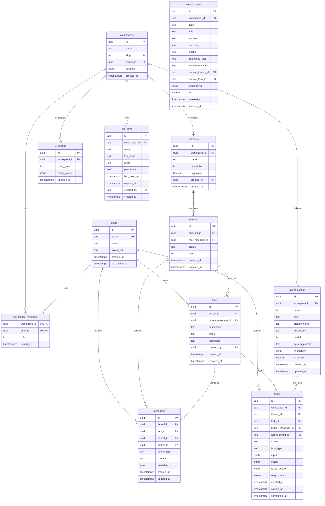

# Phase 1.5: Backend Minimum Scope

> **Updated 2026-02-08:** Terminology changed from Fork/Resolve to Deep Dive/Publish per PRODUCT-CORE-REFRAME.md

> Status: Complete | Researcher: backend-architect | Date: 2026-02-07

> **REFRAME NOTICE:** The `dives` table (formerly `forks`) stores Deep Dives. The tRPC procedures use
> `dive` terminology. The product concept is AI Deep Dive — one human + AI thinking partner.
> See [`PRODUCT-CORE-REFRAME.md`](../../design/PRODUCT-CORE-REFRAME.md).

---

## Research Question

What is the absolute minimum backend implementation needed to support the OpenVibe MVP -- a thread-based human+AI collaboration platform replacing Slack for the Vibe team (20 users)?

## Sources Consulted

### Internal Design Documents
- `docs/research/SYNTHESIS.md` -- Phase 1 research synthesis, revised module priorities, data model sketch
- `docs/research/R1-THREAD-MODEL.md` -- Fork/resolve thread model, interaction prototypes, MVP scope
- `docs/research/R3-AGENT-LIFECYCLE.md` -- Task lifecycle state machine, cost model, context overflow strategies
- `docs/research/R4-CLAUDE-TEAMS.md` -- Claude Code SDK integration, AgentRuntime interface, wrap+extend pattern
- `docs/research/R7-CONTEXT-UNIFICATION.md` -- Context bus design, MCP abstraction, shared context schema
- `docs/architecture/DESIGN-SPEC.md` -- Memory-first philosophy, Supabase choice, config system, auth model
- `docs/design/M1-THREAD-ENGINE.md` through `M6-AUTH.md` -- Existing module designs
- `docs/design/GAP-ANALYSIS.md` -- Missing ER diagram, missing infrastructure, missing search

### External Research
- Supabase Realtime docs and Next.js integration patterns (supabase.com/docs/guides/realtime)
- tRPC patterns with Supabase (noahflk.com/blog/supabase-typescript-trpc)
- PostgreSQL full-text search with GIN indexes (oneuptime.com/blog, paradedb.com/learn)
- Anthropic Agent SDK and headless Claude Code (docs.anthropic.com/en/docs/claude-code/sdk)
- Claude Code async workflows and background agents (claudefa.st/blog/guide/agents/async-workflows)

---

## 1. Complete Data Model

### ER Diagram (Mermaid)



### Table Definitions with Indexes

#### workspaces
```sql
CREATE TABLE workspaces (
  id UUID PRIMARY KEY DEFAULT gen_random_uuid(),
  name TEXT NOT NULL,
  slug TEXT UNIQUE NOT NULL,
  owner_id UUID NOT NULL REFERENCES auth.users(id),
  settings JSONB DEFAULT '{}',
  created_at TIMESTAMPTZ DEFAULT NOW()
);
```

#### users
```sql
CREATE TABLE users (
  id UUID PRIMARY KEY REFERENCES auth.users(id),
  email TEXT UNIQUE NOT NULL,
  name TEXT,
  avatar_url TEXT,
  created_at TIMESTAMPTZ DEFAULT NOW(),
  last_active_at TIMESTAMPTZ
);
```

#### workspace_members
```sql
CREATE TABLE workspace_members (
  workspace_id UUID NOT NULL REFERENCES workspaces(id) ON DELETE CASCADE,
  user_id UUID NOT NULL REFERENCES users(id) ON DELETE CASCADE,
  role TEXT NOT NULL DEFAULT 'member' CHECK (role IN ('admin', 'member')),
  joined_at TIMESTAMPTZ DEFAULT NOW(),
  PRIMARY KEY (workspace_id, user_id)
);
```

#### channels
```sql
CREATE TABLE channels (
  id UUID PRIMARY KEY DEFAULT gen_random_uuid(),
  workspace_id UUID NOT NULL REFERENCES workspaces(id) ON DELETE CASCADE,
  name TEXT NOT NULL,
  description TEXT,
  is_private BOOLEAN DEFAULT FALSE,
  created_by UUID NOT NULL REFERENCES users(id),
  created_at TIMESTAMPTZ DEFAULT NOW(),
  UNIQUE (workspace_id, name)
);

CREATE INDEX idx_channels_workspace ON channels(workspace_id);
```

#### threads
```sql
CREATE TABLE threads (
  id UUID PRIMARY KEY DEFAULT gen_random_uuid(),
  channel_id UUID NOT NULL REFERENCES channels(id) ON DELETE CASCADE,
  root_message_id UUID, -- set after first message is created
  status TEXT DEFAULT 'active' CHECK (status IN ('active', 'resolved', 'archived')),
  title TEXT, -- optional, auto-generated or manual
  created_at TIMESTAMPTZ DEFAULT NOW(),
  updated_at TIMESTAMPTZ DEFAULT NOW()
);

CREATE INDEX idx_threads_channel ON threads(channel_id);
CREATE INDEX idx_threads_status ON threads(channel_id, status);
```

#### forks
```sql
CREATE TABLE forks (
  id UUID PRIMARY KEY DEFAULT gen_random_uuid(),
  thread_id UUID NOT NULL REFERENCES threads(id) ON DELETE CASCADE,
  parent_message_id UUID NOT NULL REFERENCES messages(id),
  description TEXT, -- auto-generated or manual
  status TEXT DEFAULT 'active' CHECK (status IN ('active', 'resolved', 'abandoned')),
  resolution TEXT, -- AI-generated summary when resolved
  created_by UUID NOT NULL REFERENCES users(id),
  created_at TIMESTAMPTZ DEFAULT NOW(),
  resolved_at TIMESTAMPTZ
);

CREATE INDEX idx_forks_thread ON forks(thread_id);
CREATE INDEX idx_forks_status ON forks(thread_id, status);
```

#### messages
```sql
CREATE TABLE messages (
  id UUID PRIMARY KEY DEFAULT gen_random_uuid(),
  thread_id UUID NOT NULL REFERENCES threads(id) ON DELETE CASCADE,
  fork_id UUID REFERENCES forks(id) ON DELETE CASCADE, -- NULL = main thread
  parent_id UUID REFERENCES messages(id), -- reply chain
  author_id UUID NOT NULL, -- user_id or agent_config_id reference
  author_type TEXT NOT NULL CHECK (author_type IN ('human', 'agent', 'system')),
  content TEXT NOT NULL,
  metadata JSONB DEFAULT '{}', -- { isResolution: bool, agentConfigId: string, etc. }
  created_at TIMESTAMPTZ DEFAULT NOW(),
  updated_at TIMESTAMPTZ DEFAULT NOW()
);

CREATE INDEX idx_messages_thread ON messages(thread_id, created_at);
CREATE INDEX idx_messages_fork ON messages(fork_id, created_at);
CREATE INDEX idx_messages_author ON messages(author_id);

-- Full-text search
ALTER TABLE messages ADD COLUMN fts tsvector
  GENERATED ALWAYS AS (to_tsvector('english', content)) STORED;
CREATE INDEX idx_messages_fts ON messages USING GIN(fts);
```

#### tasks
```sql
CREATE TABLE tasks (
  id UUID PRIMARY KEY DEFAULT gen_random_uuid(),
  workspace_id UUID NOT NULL REFERENCES workspaces(id),
  thread_id UUID REFERENCES threads(id),
  fork_id UUID REFERENCES forks(id),
  trigger_message_id UUID REFERENCES messages(id),
  agent_config_id UUID NOT NULL REFERENCES agent_configs(id),
  status TEXT DEFAULT 'queued' CHECK (status IN ('queued', 'running', 'completed', 'failed')),
  task_type TEXT DEFAULT 'message_response', -- message_response | fork_resolution | thread_summary
  input JSONB DEFAULT '{}', -- { prompt, contextMessages[], etc. }
  output JSONB DEFAULT '{}', -- { response, tokensUsed, etc. }
  token_usage JSONB DEFAULT '{}', -- { input_tokens, output_tokens, model }
  retry_count INTEGER DEFAULT 0,
  created_at TIMESTAMPTZ DEFAULT NOW(),
  started_at TIMESTAMPTZ,
  completed_at TIMESTAMPTZ
);

CREATE INDEX idx_tasks_status ON tasks(status) WHERE status IN ('queued', 'running');
CREATE INDEX idx_tasks_workspace ON tasks(workspace_id, created_at DESC);
CREATE INDEX idx_tasks_agent ON tasks(agent_config_id, status);
```

#### agent_configs
```sql
CREATE TABLE agent_configs (
  id UUID PRIMARY KEY DEFAULT gen_random_uuid(),
  workspace_id UUID NOT NULL REFERENCES workspaces(id) ON DELETE CASCADE,
  name TEXT NOT NULL, -- internal identifier, e.g., 'assistant'
  slug TEXT NOT NULL, -- used for @mention, e.g., 'assistant'
  display_name TEXT NOT NULL, -- shown in UI, e.g., 'Assistant'
  description TEXT,
  model TEXT DEFAULT 'claude-sonnet-4-5', -- claude-sonnet-4-5 | claude-haiku-4-5 | claude-opus-4-6
  system_prompt TEXT, -- custom system prompt
  capabilities JSONB DEFAULT '[]', -- ['code', 'research', 'summarize']
  is_active BOOLEAN DEFAULT TRUE,
  created_at TIMESTAMPTZ DEFAULT NOW(),
  updated_at TIMESTAMPTZ DEFAULT NOW(),
  UNIQUE (workspace_id, slug)
);
```

#### ui_configs
```sql
CREATE TABLE ui_configs (
  id UUID PRIMARY KEY DEFAULT gen_random_uuid(),
  workspace_id UUID NOT NULL REFERENCES workspaces(id) ON DELETE CASCADE,
  config_key TEXT NOT NULL, -- e.g., 'sidebar_layout', 'theme', 'agent_roster_order'
  config_value JSONB NOT NULL,
  updated_at TIMESTAMPTZ DEFAULT NOW(),
  UNIQUE (workspace_id, config_key)
);
```

#### api_keys
```sql
CREATE TABLE api_keys (
  id UUID PRIMARY KEY DEFAULT gen_random_uuid(),
  workspace_id UUID NOT NULL REFERENCES workspaces(id) ON DELETE CASCADE,
  name TEXT NOT NULL,
  key_hash TEXT NOT NULL,
  prefix TEXT NOT NULL, -- first 8 chars for identification
  permissions TEXT[] DEFAULT '{}',
  last_used_at TIMESTAMPTZ,
  expires_at TIMESTAMPTZ,
  created_by UUID NOT NULL REFERENCES users(id),
  created_at TIMESTAMPTZ DEFAULT NOW()
);
```

#### context_items (minimal, for future context bus)
```sql
CREATE TABLE context_items (
  id UUID PRIMARY KEY DEFAULT gen_random_uuid(),
  workspace_id UUID NOT NULL REFERENCES workspaces(id) ON DELETE CASCADE,
  type TEXT NOT NULL CHECK (type IN ('discovery', 'decision', 'status', 'note', 'thread_summary')),
  title TEXT NOT NULL,
  content TEXT NOT NULL,
  summary TEXT, -- one-line for compact injection
  scope TEXT DEFAULT 'global' CHECK (scope IN ('task', 'thread', 'channel', 'global')),
  relevance_tags TEXT[] DEFAULT '{}',
  source_runtime TEXT, -- 'web' | 'claude-code' | 'openclaw'
  source_thread_id UUID REFERENCES threads(id),
  source_task_id UUID REFERENCES tasks(id),
  embedding vector(1536), -- pgvector, deferred but schema-ready
  created_at TIMESTAMPTZ DEFAULT NOW(),
  expires_at TIMESTAMPTZ
);

-- Full-text search on context items
ALTER TABLE context_items ADD COLUMN fts tsvector
  GENERATED ALWAYS AS (to_tsvector('english', title || ' ' || content)) STORED;
CREATE INDEX idx_context_fts ON context_items USING GIN(fts);
CREATE INDEX idx_context_workspace ON context_items(workspace_id, scope);
CREATE INDEX idx_context_tags ON context_items USING GIN(relevance_tags);
```

### Design Rationale

**Why these tables and not more:**
- `workspaces`, `users`, `workspace_members` = minimum multi-tenant auth boundary
- `channels`, `threads`, `forks`, `messages` = the fork/resolve thread model from R1
- `tasks` = agent task queue from R3 (4-state MVP subset: queued/running/completed/failed)
- `agent_configs` = workspace-level agent definitions (admin configures, frontend displays roster)
- `ui_configs` = generic key-value store for admin UI configuration; avoids building an admin console
- `context_items` = minimal context/memory table; schema-ready for vector search but embeddings deferred
- `api_keys` = agent authentication for server-side calls

**Why NOT a separate `reactions` table:** Dogfood can start without reactions. If needed, add a simple `reactions` table with (message_id, user_id, emoji) in week 5+.

**Why NOT a `notifications` table:** SYNTHESIS.md explicitly says "use Slack/email bridge initially." No notification system for dogfood.

**Why NOT `devices` table:** SYNTHESIS.md explicitly defers the entire Device System.

---

## 2. API Surface

All endpoints are tRPC procedures. Grouped by router.

### Auth Router

| Procedure | Type | Input | Output | Who |
|-----------|------|-------|--------|-----|
| `auth.getSession` | query | -- | `{ user, workspace }` | any authenticated |
| `auth.signOut` | mutation | -- | `void` | any authenticated |

Auth itself (sign-in, OAuth) is handled by Supabase Auth client-side. tRPC only exposes session info.

### Workspace Router

| Procedure | Type | Input | Output | Who |
|-----------|------|-------|--------|-----|
| `workspace.get` | query | -- | `Workspace` | member |
| `workspace.update` | mutation | `{ name?, settings? }` | `Workspace` | admin |
| `workspace.listMembers` | query | -- | `WorkspaceMember[]` | member |
| `workspace.invite` | mutation | `{ email, role }` | `Invite` | admin |
| `workspace.removeMember` | mutation | `{ userId }` | `void` | admin |
| `workspace.updateMemberRole` | mutation | `{ userId, role }` | `void` | admin |

### Channel Router

| Procedure | Type | Input | Output | Who |
|-----------|------|-------|--------|-----|
| `channel.list` | query | -- | `Channel[]` | member |
| `channel.create` | mutation | `{ name, description?, isPrivate? }` | `Channel` | member |
| `channel.get` | query | `{ channelId }` | `Channel` with recent threads | member |
| `channel.update` | mutation | `{ channelId, name?, description? }` | `Channel` | admin |
| `channel.delete` | mutation | `{ channelId }` | `void` | admin |

### Thread Router

| Procedure | Type | Input | Output | Who |
|-----------|------|-------|--------|-----|
| `thread.list` | query | `{ channelId, cursor?, limit? }` | `{ threads, nextCursor }` | member |
| `thread.get` | query | `{ threadId }` | `Thread` with messages + forks | member |
| `thread.create` | mutation | `{ channelId, content }` | `{ thread, message }` | member |
| `thread.updateStatus` | mutation | `{ threadId, status }` | `Thread` | member |

### Fork Router

| Procedure | Type | Input | Output | Who |
|-----------|------|-------|--------|-----|
| `fork.list` | query | `{ threadId }` | `Fork[]` | member |
| `fork.get` | query | `{ forkId }` | `Fork` with messages | member |
| `fork.create` | mutation | `{ threadId, parentMessageId, description? }` | `Fork` | member |
| `fork.resolve` | mutation | `{ forkId }` | `Fork` (triggers AI summary task) | member |
| `fork.abandon` | mutation | `{ forkId }` | `Fork` | member |

### Message Router

| Procedure | Type | Input | Output | Who |
|-----------|------|-------|--------|-----|
| `message.list` | query | `{ threadId, forkId?, cursor?, limit? }` | `{ messages, nextCursor }` | member |
| `message.send` | mutation | `{ threadId, forkId?, parentId?, content, mentions? }` | `Message` | member |
| `message.update` | mutation | `{ messageId, content }` | `Message` | author only |
| `message.delete` | mutation | `{ messageId }` | `void` | author or admin |

### Agent Router

| Procedure | Type | Input | Output | Who |
|-----------|------|-------|--------|-----|
| `agent.list` | query | -- | `AgentConfig[]` (active agents in workspace) | member |
| `agent.get` | query | `{ agentId }` | `AgentConfig` | member |
| `agent.create` | mutation | `{ name, slug, displayName, model, systemPrompt?, capabilities? }` | `AgentConfig` | admin |
| `agent.update` | mutation | `{ agentId, ...fields }` | `AgentConfig` | admin |
| `agent.toggleActive` | mutation | `{ agentId, isActive }` | `AgentConfig` | admin |

### Task Router

| Procedure | Type | Input | Output | Who |
|-----------|------|-------|--------|-----|
| `task.get` | query | `{ taskId }` | `Task` | member |
| `task.list` | query | `{ status?, agentId?, limit? }` | `Task[]` | member |
| `task.cancel` | mutation | `{ taskId }` | `Task` | member (own task) or admin |

Tasks are NOT created directly via API. They are created internally when:
1. A message with @mention is sent (message.send detects mention -> creates task)
2. A fork is resolved (fork.resolve -> creates summary task)

### Config Router

| Procedure | Type | Input | Output | Who |
|-----------|------|-------|--------|-----|
| `config.get` | query | `{ key }` | `UIConfig` | member |
| `config.list` | query | -- | `UIConfig[]` | member |
| `config.set` | mutation | `{ key, value }` | `UIConfig` | admin |

### Search Router

| Procedure | Type | Input | Output | Who |
|-----------|------|-------|--------|-----|
| `search.messages` | query | `{ query, channelId?, limit? }` | `{ messages, highlights }` | member |

### Total: ~30 procedures

This is the minimum API that supports: channel browsing, thread creation, fork/resolve flow, @mention agent invocation, admin config, and search.

---

## 3. Real-time Events

### Event Catalog

| Event | Payload | Trigger | Subscribe Pattern |
|-------|---------|---------|-------------------|
| `message.created` | `Message` | New message inserted | per-thread |
| `message.updated` | `Message` | Message edited | per-thread |
| `message.deleted` | `{ messageId }` | Message removed | per-thread |
| `fork.created` | `Fork` | New fork created | per-thread |
| `fork.resolved` | `Fork` (with resolution) | Fork resolved | per-thread |
| `fork.abandoned` | `Fork` | Fork abandoned | per-thread |
| `task.status_changed` | `{ taskId, status, agentId }` | Task status changes | per-thread |
| `thread.updated` | `Thread` | Thread status changes | per-channel |
| `typing.indicator` | `{ threadId, forkId?, userId, isAgent }` | User/agent is composing | per-thread |

### Subscription Architecture

**Per-thread subscriptions** (primary pattern):
```typescript
// Frontend subscribes when opening a thread
const channel = supabase
  .channel(`thread:${threadId}`)
  .on('postgres_changes', {
    event: 'INSERT',
    schema: 'public',
    table: 'messages',
    filter: `thread_id=eq.${threadId}`
  }, handleNewMessage)
  .on('postgres_changes', {
    event: '*',
    schema: 'public',
    table: 'forks',
    filter: `thread_id=eq.${threadId}`
  }, handleForkChange)
  .on('postgres_changes', {
    event: 'UPDATE',
    schema: 'public',
    table: 'tasks',
    filter: `thread_id=eq.${threadId}`
  }, handleTaskUpdate)
  .subscribe();
```

**Per-channel subscriptions** (for thread list updates):
```typescript
const channel = supabase
  .channel(`channel:${channelId}`)
  .on('postgres_changes', {
    event: '*',
    schema: 'public',
    table: 'threads',
    filter: `channel_id=eq.${channelId}`
  }, handleThreadUpdate)
  .subscribe();
```

**Typing indicators** use Supabase Broadcast (ephemeral, no DB write):
```typescript
const channel = supabase.channel(`typing:${threadId}`);

// Send typing
channel.send({
  type: 'broadcast',
  event: 'typing',
  payload: { userId, forkId, isAgent: false }
});

// Receive typing
channel.on('broadcast', { event: 'typing' }, handleTyping);
```

### Why NOT per-workspace subscriptions

20 users with ~10 channels = ~200 threads active. Per-workspace subscription would fire for every message in every thread, and the client would have to filter client-side. Per-thread subscriptions are targeted: the client only receives events for the thread(s) it's viewing. When the user switches threads, unsubscribe from the old, subscribe to the new.

### Supabase Realtime Configuration

Enable Realtime on these tables only:
```sql
ALTER PUBLICATION supabase_realtime ADD TABLE messages;
ALTER PUBLICATION supabase_realtime ADD TABLE forks;
ALTER PUBLICATION supabase_realtime ADD TABLE tasks;
ALTER PUBLICATION supabase_realtime ADD TABLE threads;
```

Do NOT enable Realtime on `users`, `workspaces`, `agent_configs`, `ui_configs` -- these change rarely and can be fetched via tRPC.

---

## 4. Agent Integration Layer

### The @mention Pipeline

```
User types "@Assistant what is the status of project X?"
                        |
                        v
            [message.send tRPC mutation]
                        |
                        v
        [Parse message content for @mentions]
        - Extract mentioned agent slugs
        - Look up agent_configs by slug
                        |
                        v
        [Insert message into messages table]
        (Supabase Realtime broadcasts to all thread subscribers)
                        |
                        v
        [For each mentioned agent:]
        [Create task row: status='queued']
        (Supabase Realtime broadcasts task.status_changed)
                        |
                        v
        [Agent Worker picks up queued task]
        - Build context: recent thread messages + fork context + system prompt
        - Call Anthropic Messages API (stream)
        - Update task: status='running'
                        |
                        v
        [Stream response tokens]
        - Insert agent message (author_type='agent') into messages table
        - Supabase Realtime broadcasts message.created
        - Frontend renders streaming response
                        |
                        v
        [Complete]
        - Update task: status='completed', token_usage, output
        - If task failed: status='failed', retry up to 3 times
```

### Implementation: Direct API Call (Simplest)

For the 20-user dogfood, the simplest agent invocation is a **synchronous-ish server-side call** within the tRPC mutation handler:

```typescript
// In message.send mutation handler (simplified)
async function handleAgentMention(
  message: Message,
  agentConfig: AgentConfig,
  threadContext: Message[]
) {
  // 1. Create task
  const task = await db.tasks.create({
    workspace_id: message.workspace_id,
    thread_id: message.thread_id,
    fork_id: message.fork_id,
    trigger_message_id: message.id,
    agent_config_id: agentConfig.id,
    status: 'queued',
    task_type: 'message_response',
    input: { prompt: message.content, context: threadContext }
  });

  // 2. Fire and forget -- don't block the user's message.send response
  processAgentTask(task.id).catch(err => {
    console.error(`Task ${task.id} failed:`, err);
    db.tasks.update(task.id, { status: 'failed', output: { error: err.message } });
  });

  return task;
}

async function processAgentTask(taskId: string) {
  const task = await db.tasks.findById(taskId);
  const agentConfig = await db.agentConfigs.findById(task.agent_config_id);

  // 3. Update status
  await db.tasks.update(taskId, { status: 'running', started_at: new Date() });

  // 4. Build prompt
  const systemPrompt = agentConfig.system_prompt || DEFAULT_SYSTEM_PROMPT;
  const contextMessages = await getThreadContext(task.thread_id, task.fork_id);

  // 5. Call Anthropic API (streaming)
  const stream = await anthropic.messages.stream({
    model: agentConfig.model,
    max_tokens: 4096,
    system: systemPrompt,
    messages: contextMessages.map(m => ({
      role: m.author_type === 'human' ? 'user' : 'assistant',
      content: m.content
    }))
  });

  // 6. Collect full response
  let fullResponse = '';
  for await (const chunk of stream) {
    if (chunk.type === 'content_block_delta') {
      fullResponse += chunk.delta.text;
    }
  }

  // 7. Insert agent message
  await db.messages.create({
    thread_id: task.thread_id,
    fork_id: task.fork_id,
    parent_id: task.trigger_message_id,
    author_id: agentConfig.id,
    author_type: 'agent',
    content: fullResponse,
    metadata: { agentConfigId: agentConfig.id, taskId }
  });

  // 8. Complete task
  const usage = stream.finalMessage().usage;
  await db.tasks.update(taskId, {
    status: 'completed',
    completed_at: new Date(),
    token_usage: { input_tokens: usage.input_tokens, output_tokens: usage.output_tokens, model: agentConfig.model },
    output: { messageLength: fullResponse.length }
  });
}
```

### Why NOT a separate queue system

For 20 users, a separate job queue (Redis, BullMQ, etc.) adds infrastructure complexity with no meaningful benefit. The pattern above is:
- **Fire and forget**: The user's `message.send` returns immediately. The agent task runs asynchronously on the same Next.js server process.
- **Status visible**: Task status changes are written to Postgres and broadcast via Supabase Realtime.
- **Idempotent**: If the server restarts mid-task, queued tasks can be re-processed on startup by scanning for `status='queued'` or `status='running'` with `started_at` older than 5 minutes.

### Fork Resolution Flow

When `fork.resolve` is called:

```typescript
async function resolveFork(forkId: string) {
  const fork = await db.forks.findById(forkId);
  const forkMessages = await db.messages.findByFork(forkId);
  const parentMessage = await db.messages.findById(fork.parent_message_id);

  // 1. Create summary task
  const task = await db.tasks.create({
    thread_id: fork.thread_id,
    fork_id: forkId,
    agent_config_id: getDefaultAgent(fork.workspace_id),
    status: 'queued',
    task_type: 'fork_resolution',
    input: {
      parentMessage: parentMessage.content,
      forkMessages: forkMessages.map(m => ({ author: m.author_type, content: m.content })),
      forkDescription: fork.description
    }
  });

  // 2. Process async
  processResolutionTask(task.id).catch(handleError);
}

async function processResolutionTask(taskId: string) {
  // ... similar to processAgentTask but:
  // - Uses a specialized resolution prompt
  // - Inserts the resolution summary as a message in the PARENT thread (fork_id = NULL)
  // - Updates fork.status = 'resolved', fork.resolution = summary, fork.resolved_at = now()
  // - The resolution message has metadata: { isResolution: true, resolvedForkId: forkId }
}
```

### Error Handling

| Failure | Behavior |
|---------|----------|
| Anthropic API 500/503 | Retry up to 3 times with exponential backoff (1s, 5s, 15s) |
| Rate limit (429) | Retry after `retry-after` header value |
| Context too long | Truncate oldest messages from context, retry once |
| Timeout (>120s) | Mark task as failed, post system message "Agent timed out" |
| Invalid response | Mark task as failed, log error, post system message |
| Server restart | On startup, find `status='running'` tasks older than 5 min, reset to `status='queued'` |

### Agent "Thinking" Indicator

When a task transitions to `running`, the frontend shows a typing indicator for the agent. This is driven by the `task.status_changed` Realtime event -- no separate mechanism needed.

---

## 5. Auth & Permissions

### Supabase Auth Setup

**Email + Google OAuth (MVP):**

```typescript
// Supabase project config (dashboard or supabase/config.toml)
[auth]
site_url = "https://openvibe.example.com"
additional_redirect_urls = ["http://localhost:3000/auth/callback"]

[auth.external.google]
enabled = true
client_id = "env(GOOGLE_CLIENT_ID)"
secret = "env(GOOGLE_CLIENT_SECRET)"
```

**Auth flow:**
1. User clicks "Sign in with Google" -> Supabase handles OAuth
2. On callback, check if user exists in `users` table
3. If new user, create `users` row + redirect to workspace join/create flow
4. If existing user, load workspace membership and redirect to workspace

### Roles (MVP: 2 roles)

| Role | Description |
|------|-------------|
| `admin` | Can manage workspace, channels, agents, invite members, configure UI |
| `member` | Can use channels, send messages, create forks, @mention agents |

The workspace `owner_id` is always an admin. No separate owner role in the `workspace_members` table -- owner is just the admin who created the workspace.

### Row-Level Security Policies

```sql
-- Enable RLS on all tables
ALTER TABLE workspaces ENABLE ROW LEVEL SECURITY;
ALTER TABLE workspace_members ENABLE ROW LEVEL SECURITY;
ALTER TABLE channels ENABLE ROW LEVEL SECURITY;
ALTER TABLE threads ENABLE ROW LEVEL SECURITY;
ALTER TABLE forks ENABLE ROW LEVEL SECURITY;
ALTER TABLE messages ENABLE ROW LEVEL SECURITY;
ALTER TABLE tasks ENABLE ROW LEVEL SECURITY;
ALTER TABLE agent_configs ENABLE ROW LEVEL SECURITY;
ALTER TABLE ui_configs ENABLE ROW LEVEL SECURITY;
ALTER TABLE context_items ENABLE ROW LEVEL SECURITY;

-- Helper function: get user's workspace IDs
CREATE OR REPLACE FUNCTION user_workspace_ids()
RETURNS SETOF UUID AS $$
  SELECT workspace_id FROM workspace_members WHERE user_id = auth.uid()
$$ LANGUAGE SQL SECURITY DEFINER STABLE;

-- Workspace isolation (applied to all workspace-scoped tables)
-- Example for messages:
CREATE POLICY "workspace_isolation" ON messages FOR ALL USING (
  thread_id IN (
    SELECT t.id FROM threads t
    JOIN channels c ON t.channel_id = c.id
    WHERE c.workspace_id IN (SELECT user_workspace_ids())
  )
);

-- Channel access (public channels visible to all members, private requires explicit permission)
CREATE POLICY "channel_access" ON channels FOR SELECT USING (
  workspace_id IN (SELECT user_workspace_ids())
  AND (
    NOT is_private
    OR id IN (SELECT channel_id FROM channel_members WHERE user_id = auth.uid())
  )
);

-- Users can only edit their own messages
CREATE POLICY "own_messages_update" ON messages FOR UPDATE USING (
  author_id = auth.uid() AND author_type = 'human'
);

-- Admin check for mutations on agent_configs, ui_configs
CREATE POLICY "admin_only_agent_config" ON agent_configs FOR ALL USING (
  workspace_id IN (
    SELECT workspace_id FROM workspace_members
    WHERE user_id = auth.uid() AND role = 'admin'
  )
);
```

### Agent Authentication

Agents don't use Supabase Auth. They authenticate via service role key or API keys:

**Option A (MVP): Supabase service role key** -- The Next.js server uses the service role key for all agent-initiated database writes. Since the agent task processor runs server-side, it bypasses RLS using the service role client.

```typescript
// Server-side agent client
const supabaseAdmin = createClient(SUPABASE_URL, SUPABASE_SERVICE_ROLE_KEY);
// This client bypasses RLS -- only used in server-side task processor
```

**Option B (future): API keys** -- For external agent runtimes (OpenClaw, Claude Code via MCP), use the `api_keys` table. Agent sends `Authorization: Bearer vibe_xxxxx`, server validates against `key_hash`.

### What permissions exist for MVP

| Action | Admin | Member | Agent (server-side) |
|--------|-------|--------|---------------------|
| Manage workspace settings | yes | no | no |
| Manage agent configs | yes | no | no |
| Set UI configs | yes | no | no |
| Invite/remove members | yes | no | no |
| Create channels | yes | yes | no |
| Send messages | yes | yes | yes (in response to task) |
| Create forks | yes | yes | no |
| Resolve/abandon forks | yes | yes | yes (for resolution tasks) |
| View all channels | yes | yes (public + joined private) | yes |
| Search messages | yes | yes | no |

---

## 6. Search Implementation

### Recommendation: PostgreSQL Built-in tsvector

For 20 users generating maybe a few thousand messages per week, PostgreSQL's built-in full-text search is more than sufficient. No external search engine needed.

### Implementation

The `messages` table already has a generated `fts` tsvector column:

```sql
-- Already in schema above
ALTER TABLE messages ADD COLUMN fts tsvector
  GENERATED ALWAYS AS (to_tsvector('english', content)) STORED;
CREATE INDEX idx_messages_fts ON messages USING GIN(fts);
```

**tRPC search procedure:**

```typescript
// search.messages
async function searchMessages(input: { query: string; channelId?: string; limit?: number }) {
  const { query, channelId, limit = 20 } = input;

  // Convert user query to tsquery
  // plainto_tsquery handles natural language input
  const results = await db.execute(sql`
    SELECT
      m.id,
      m.thread_id,
      m.fork_id,
      m.content,
      m.author_id,
      m.author_type,
      m.created_at,
      ts_headline('english', m.content, plainto_tsquery('english', ${query}),
        'StartSel=<mark>, StopSel=</mark>, MaxWords=50, MinWords=20') as highlight,
      ts_rank(m.fts, plainto_tsquery('english', ${query})) as rank
    FROM messages m
    JOIN threads t ON m.thread_id = t.id
    JOIN channels c ON t.channel_id = c.id
    WHERE
      m.fts @@ plainto_tsquery('english', ${query})
      AND c.workspace_id = ${workspaceId}
      ${channelId ? sql`AND c.id = ${channelId}` : sql``}
    ORDER BY rank DESC
    LIMIT ${limit}
  `);

  return { messages: results, query };
}
```

### Why tsvector and not pg_trgm

- **tsvector** operates on words with stemming, is language-aware, and uses GIN indexes for fast lookups. For a team chat where people search for "pricing discussion" or "deploy failed", word-level matching is exactly right.
- **pg_trgm** is for fuzzy/substring matching (typo tolerance). Overkill for MVP. Can be added later if users want fuzzy search.
- **External search (Elasticsearch, Typesense):** Absolutely not for 20 users. PostgreSQL handles millions of documents with sub-second GIN queries.

### Future Path to Semantic Search

The `context_items` table already has a `vector(1536)` column for pgvector. When the time comes:

1. Generate embeddings for messages using an embedding model (Anthropic or OpenAI)
2. Store in `context_items.embedding`
3. Add a `search.semantic` tRPC procedure that does cosine similarity search
4. Combine full-text rank + vector similarity for hybrid search

This is a Phase 2+ concern. For dogfood, tsvector full-text search covers the need.

---

## 7. Infrastructure

### Deployment Architecture

```
                    ┌──────────────────────────┐
                    │       Vercel             │
                    │  ┌───────────────────┐   │
                    │  │   Next.js App      │   │
                    │  │   (App Router)     │   │
                    │  │                    │   │
                    │  │  - tRPC API routes │   │
                    │  │  - React frontend  │   │
                    │  │  - Agent task      │   │
                    │  │    processor       │   │
                    │  └────────┬───────────┘   │
                    └───────────┼───────────────┘
                                │
                    ┌───────────┼───────────────┐
                    │           │               │
            ┌───────▼──────┐  ┌▼──────────────┐
            │  Supabase    │  │  Anthropic    │
            │  (managed)   │  │  API          │
            │              │  │               │
            │  - Postgres  │  │  - Messages   │
            │  - pgvector  │  │  - Streaming  │
            │  - Realtime  │  └───────────────┘
            │  - Auth      │
            │  - Storage   │
            └──────────────┘
```

### Where Each Component Runs

| Component | Where | Why |
|-----------|-------|-----|
| Next.js (frontend + API) | Vercel | Zero-config deployment, serverless scaling, good Supabase integration |
| tRPC API routes | Vercel Serverless Functions | Colocated with frontend, auto-scaling |
| Agent task processor | Vercel Serverless Functions | Same process as API routes for simplicity |
| Database | Supabase (managed Postgres) | Free tier for dogfood, zero ops |
| Auth | Supabase Auth | Built-in, no custom auth server |
| File storage | Supabase Storage | For file attachments (phase 2) |
| Anthropic API | Anthropic cloud | Direct API calls from Vercel functions |

### Agent Runtime Concern: Vercel Function Timeout

Vercel Serverless Functions have a max execution time of 60s (Pro plan). Agent responses can take 10-30s for complex prompts, which is within limits. For tasks that might exceed 60s:

**Option A (recommended for dogfood):** Use Vercel Pro plan (300s timeout on Fluid compute). Most agent tasks complete in 10-30s.

**Option B (if needed):** Move agent task processor to a separate long-running service (Railway, Fly.io, or a simple Node.js process on a VPS). The task processor polls `tasks` table for `status='queued'`, processes them, writes results back. The Next.js app just writes to the tasks table and serves the UI.

For dogfood, Option A is sufficient. The architecture supports migrating to Option B without any API changes -- just move `processAgentTask` to a separate service.

### Supabase Project Setup

1. Create Supabase project (free tier is fine for dogfood: 500MB database, 2 GB bandwidth, 50K monthly active users)
2. Enable pgvector extension: `CREATE EXTENSION IF NOT EXISTS vector;`
3. Run migration SQL from Section 1
4. Configure Auth providers (Google OAuth)
5. Set up Realtime publication for messages, forks, tasks, threads

### Environment Variables

```env
# Supabase
NEXT_PUBLIC_SUPABASE_URL=https://xxxxx.supabase.co
NEXT_PUBLIC_SUPABASE_ANON_KEY=eyJhbG...
SUPABASE_SERVICE_ROLE_KEY=eyJhbG...

# Anthropic
ANTHROPIC_API_KEY=sk-ant-...

# Auth
GOOGLE_CLIENT_ID=xxxxx.apps.googleusercontent.com
GOOGLE_CLIENT_SECRET=GOCSPX-...

# App
NEXT_PUBLIC_APP_URL=https://openvibe.example.com
```

### CI/CD Minimum

**GitHub Actions workflow (deploy on push to main):**

```yaml
name: Deploy
on:
  push:
    branches: [main]

jobs:
  deploy:
    runs-on: ubuntu-latest
    steps:
      - uses: actions/checkout@v4
      - uses: actions/setup-node@v4
        with:
          node-version: 20
      - run: npm ci
      - run: npm run lint
      - run: npm run typecheck
      - run: npm run build
      # Vercel auto-deploys from GitHub; this just validates
```

For dogfood, Vercel's Git integration (auto-deploy on push) is sufficient. The GitHub Actions workflow above is a gate for lint + typecheck. No test suite in Phase 1 -- add in Phase 2.

Database migrations: Manual for now. Run migration SQL via Supabase dashboard SQL editor or `supabase db push`. Proper migration tooling (Supabase CLI or Drizzle migrations) in Phase 2.

### Monitoring Minimum

| What | How | Why |
|------|-----|-----|
| App errors | Vercel built-in error tracking + logs | Know when API routes throw |
| Agent task failures | Query `tasks` table: `SELECT * FROM tasks WHERE status='failed' ORDER BY created_at DESC` | Know when agents break |
| Anthropic API errors | Log in agent task processor, surface in Vercel logs | Know when LLM is down |
| Database health | Supabase dashboard (built-in) | Connection count, query performance |
| User activity | `users.last_active_at` column | Know if anyone is using it |
| Token usage | `tasks.token_usage` column, query: `SELECT SUM((token_usage->>'input_tokens')::int + (token_usage->>'output_tokens')::int) FROM tasks WHERE created_at > NOW() - INTERVAL '1 day'` | Track AI costs daily |

**No Datadog, no Sentry, no custom dashboards for dogfood.** Vercel logs + Supabase dashboard + a daily SQL query for costs. Add monitoring when there's something to monitor at scale.

---

## 8. What NOT to Build

| Feature | Why Deferred | Dogfood Workaround |
|---------|-------------|-------------------|
| **Advanced RBAC (owner/guest/custom roles)** | 2 roles (admin/member) cover all dogfood needs | Admin does admin things, everyone else is member |
| **Rate limiting** | 20 trusted internal users | Trust the team; monitor token usage manually |
| **Billing/subscription** | Internal tool, no revenue yet | Track token costs via SQL query |
| **Webhooks** | No external integrations needed for dogfood | Direct Anthropic API calls |
| **Plugin/extension API** | No external developers yet | Hardcode the 2-3 agent types needed |
| **Notification system** | Would require email/push infrastructure | Post important updates in #general; use existing Slack for urgent items during transition |
| **File attachments** | Not critical for day 1 | Share files via existing tools (Google Drive, Slack), paste links in OpenVibe |
| **Reactions/emoji** | Nice to have, not essential | Reply with text acknowledgment |
| **Multiple workspaces per user** | Vibe is one workspace | Single workspace; schema supports multi-workspace for future |
| **Private channels** | All 20 users are on the same team | All channels are public; `is_private` column exists for future |
| **Thread titles** | Auto-generate from first message content | First ~50 chars of root message as title |
| **Message editing history** | Low value for dogfood | `updated_at` column tracks last edit, no history |
| **User presence (online/offline)** | Requires websocket heartbeat infrastructure | Users just post when they're around |
| **Unread message tracking** | Requires per-user cursor tracking | Scroll to bottom; search if you missed something |
| **Agent Teams / multi-agent coordination** | Single-agent is sufficient for dogfood | One agent per @mention; no agent-to-agent coordination |
| **Cross-runtime context (OpenClaw, Claude Code)** | Interfaces defined in R7, implementation deferred | `context_items` table exists; OpenClaw and Claude Code keep their existing context systems |
| **Semantic/vector search** | tsvector is sufficient for 20 users | Full-text keyword search; pgvector column exists for future |
| **Admin console UI** | `ui_configs` table + tRPC is enough | Admin uses `config.set` mutations via a simple admin page or direct Supabase dashboard |
| **Email invitations** | Adds email infrastructure | Share invite link directly (Slack DM, in person) |
| **SAML/SSO** | Enterprise feature | Google OAuth covers Vibe team |
| **Audit logging** | Compliance feature for regulated verticals | `created_at` timestamps on all rows; Supabase logs |
| **Data export/GDPR** | No external users yet | Direct database access if needed |
| **Mobile UI** | Desktop-first per SYNTHESIS.md | Use desktop browser |
| **Offline support** | Internet always available for Vibe team | Requires internet |
| **Device System** | Irrelevant for Slack replacement | No hardware integration |

---

## 9. Implementation Estimate

### Work Packages (ordered by dependency)

| # | Package | Description | Estimate | Dependencies |
|---|---------|-------------|----------|--------------|
| 1 | **Project Setup** | Nx monorepo, Next.js app, Supabase project, tRPC scaffold, env vars, Vercel deploy | 2 days | -- |
| 2 | **Database Schema** | All migrations, RLS policies, Realtime publication, seed data (default workspace, channels, agent configs) | 2 days | #1 |
| 3 | **Auth Flow** | Supabase Auth integration, Google OAuth, user creation on first login, workspace join flow | 2 days | #1, #2 |
| 4 | **Channel & Thread CRUD** | channel.*, thread.* tRPC routers, basic UI: channel list sidebar, thread list, thread view | 3 days | #2, #3 |
| 5 | **Message System** | message.* tRPC router, Realtime subscriptions, message composition, markdown rendering, message list with infinite scroll | 3 days | #4 |
| 6 | **Fork System** | fork.* tRPC router, fork creation UI, fork sidebar, fork view, fork status management | 3 days | #5 |
| 7 | **Agent Integration** | agent.* and task.* tRPC routers, @mention detection and parsing, agent task processor, Anthropic API integration, agent message rendering (distinct styling) | 4 days | #5 |
| 8 | **Fork Resolution** | Resolution task processor, AI summary generation, resolution message insertion, fork resolve/abandon UI flow | 2 days | #6, #7 |
| 9 | **Search** | search.messages tRPC, search UI (command palette or search page), result rendering with highlights | 2 days | #5 |
| 10 | **Admin Config** | config.* tRPC router, simple admin page for agent management and UI config | 1 day | #7 |
| 11 | **Polish & Deploy** | Error states, loading states, empty states, responsive layout, typing indicators, "agent thinking" indicator, production deploy | 3 days | all |

### Effort Summary

| Category | Days |
|----------|------|
| Infrastructure (#1-3) | 6 |
| Core messaging (#4-6) | 9 |
| Agent system (#7-8) | 6 |
| Search + Config (#9-10) | 3 |
| Polish (#11) | 3 |
| **Total** | **27 working days** |

**Calendar time: ~6 weeks** for one experienced full-stack developer (accounting for context switching, debugging, and inevitable scope creep).

**With two developers:** ~4 weeks. Developer A handles #1-3, #7-8, #10. Developer B handles #4-6, #9, #11. They sync on integration points (message format, Realtime events).

### Critical Path

```
#1 Project Setup
  -> #2 Schema
    -> #3 Auth
      -> #4 Channels/Threads
        -> #5 Messages (CORE -- everything depends on this)
          -> #6 Forks (depends on messages)
          -> #7 Agent Integration (depends on messages)
            -> #8 Fork Resolution (depends on forks + agents)
          -> #9 Search (depends on messages)
      -> #10 Admin Config (depends on agents)
    -> #11 Polish (depends on everything)
```

Messages (#5) is the critical node. Once message send/receive/display works with Realtime, everything else builds on top.

### Build Order Recommendation

**Week 1:** #1 + #2 + #3 (foundations)
**Week 2:** #4 + #5 (channels, threads, messages -- the core loop)
**Week 3:** #6 + #7 (forks + agent integration)
**Week 4:** #8 + #9 + #10 (resolution, search, admin)
**Week 5:** #11 (polish, deploy, fix)
**Week 6:** Buffer for overruns, dogfood prep (seed channels, configure agents, write onboarding instructions)

---

## Options Explored

### API Layer: tRPC vs REST vs GraphQL

**tRPC (recommended):**
- End-to-end type safety between Next.js frontend and API
- Zero codegen, zero schema definition overhead
- Natural fit with Next.js App Router
- ~30 procedures is manageable in a single router

**REST:** Would require manual type definitions or OpenAPI codegen. More boilerplate for the same functionality.

**GraphQL:** Overkill for a single-client app. Adds resolver complexity, schema definition, and a runtime (Apollo/URQL) for no benefit when there's one frontend.

### Real-time: Supabase Realtime vs Socket.IO vs custom WebSocket

**Supabase Realtime (recommended):**
- Already part of the stack
- Postgres-change-driven: insert a row, all subscribers get it
- No separate WebSocket server to deploy
- Broadcast channel for ephemeral events (typing indicators)

**Socket.IO:** Would require a separate server process, session management, reconnection logic. For 20 users this is unnecessary infrastructure.

**Custom WebSocket:** Even more infrastructure for no benefit.

### Agent invocation: Direct API call vs Job Queue vs Serverless Functions

**Direct API call (recommended for dogfood):**
- Simplest: call Anthropic API in the same server process
- Fire-and-forget from the mutation handler
- Task table provides status tracking and retry
- Works within Vercel's 300s function timeout

**Job Queue (BullMQ/Redis):** Adds Redis infrastructure. Justified at scale but overkill for 20 users with <100 agent tasks/day.

**Separate Serverless Functions:** Would mean deploying agent workers as separate Vercel functions or a separate service. Added complexity for zero benefit at dogfood scale.

### Database: Supabase Postgres vs PlanetScale vs Neon

**Supabase Postgres (recommended):**
- pgvector for future semantic search
- Realtime built-in
- Auth built-in
- Storage built-in
- Free tier sufficient for dogfood

**PlanetScale (MySQL):** No pgvector, no Realtime, no Auth. Would need separate services for each.

**Neon (Postgres):** Good serverless Postgres but no Realtime, no Auth, no Storage. Would need Supabase-like stack assembled manually.

---

## Open Questions

1. **Streaming agent responses:** The implementation above collects the full response before inserting a message. An alternative is to insert an empty message immediately (showing "Agent is typing..."), then update it as tokens stream in. This provides better UX but requires message UPDATE Realtime events and partial content rendering. Is the extra complexity worth it for dogfood?

2. **Agent context window:** How many thread messages should be included as context for the agent? All of them (risks hitting token limits on long threads)? Last N messages? A summary of the thread + last N? Recommendation: last 50 messages for now, add summarization when threads get long.

3. **Fork depth:** R1 recommends max 1 level (no fork-from-fork). The schema supports arbitrary depth (fork can reference a message that's in another fork). Should the API enforce the 1-level limit or leave it to the UI?

4. **Workspace creation flow:** Who creates the first workspace? Manual seed via Supabase dashboard? A setup wizard on first visit? For dogfood, seed via migration or dashboard.

5. **Default agent configurations:** What agents should be pre-configured for the Vibe workspace? Recommendation: `@assistant` (general, Sonnet), `@coder` (code-focused, Sonnet), `@researcher` (research-focused, Opus for quality). Configured as seed data.

6. **Message size limit:** Should there be a max message length? PostgreSQL TEXT type has no practical limit, but extremely long messages would impact Realtime payload size and rendering. Recommendation: 50K character limit enforced at the API layer.

---

## Rejected Approaches

### 1. Microservices Architecture

**Rejected because:** 20 users do not justify the operational complexity of multiple services. A single Next.js application handles API, frontend, and agent task processing. The data model supports extracting services later (agent processor, search) when scale demands it.

**Reconsider when:** User count exceeds 200+ or agent task load requires dedicated compute.

### 2. Redis for Task Queue

**Rejected because:** Postgres `tasks` table with `status` column + Supabase Realtime provides task queuing, status tracking, and event notification. Redis adds an infrastructure dependency for a feature that Postgres handles at dogfood scale.

**Reconsider when:** Task throughput exceeds what a simple Postgres poll can handle (>1000 tasks/hour) or task processing requires priority queues with sub-second dequeue latency.

### 3. Separate Agent Service (Claude Code SDK Headless)

**Rejected because:** R4 recommends Claude Code SDK for coding tasks on a local machine. For the dogfood MVP, agents respond to @mentions with text -- they don't need filesystem access, terminal execution, or code editing. Direct Anthropic Messages API calls are simpler and sufficient.

**Reconsider when:** Agent tasks require file operations, code execution, or multi-step tool use. At that point, wrap Claude Code SDK as an alternative agent runtime behind the AgentRuntime interface from R4.

### 4. Event Sourcing for Messages

**Rejected because:** Messages are append-mostly (create >> update/delete). A simple table with Realtime subscription provides the same eventual consistency guarantee as event sourcing without the complexity of event store, projections, and replay.

**Reconsider when:** Regulatory requirements demand complete audit trails of every message edit, or offline-first architecture requires CRDTs.

### 5. Drizzle/Prisma ORM from Day 1

**Rejected because:** The data model is simple enough (10 tables) that raw SQL migrations + Supabase client for queries is sufficient. An ORM adds a dependency and abstraction layer without clear benefit at this scale.

**Reconsider when:** The schema exceeds 20+ tables with complex relations and the team grows beyond 1-2 developers who need schema coordination.

### 6. Custom Notification System

**Rejected because:** Building email/push notifications requires: email provider integration (Resend/SendGrid), push notification infrastructure, per-user notification preferences, notification aggregation/batching, unread tracking. This is 1-2 weeks of work that doesn't help replace Slack.

**Reconsider when:** The team complains they're missing important messages. First step: add browser notification support (Web Push API, ~1 day). Full notification system only when there's real demand.

---

*Research completed: 2026-02-07*
*Researcher: backend-architect*
