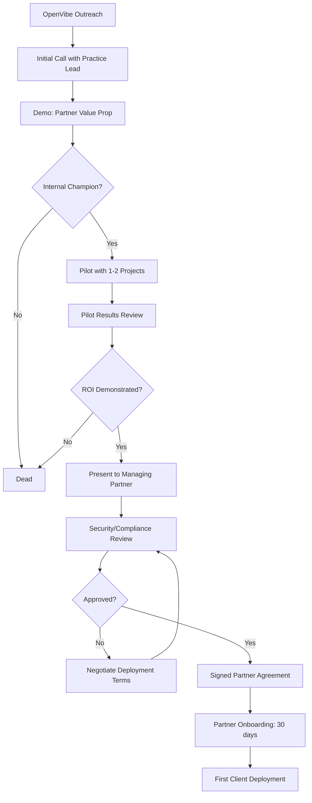
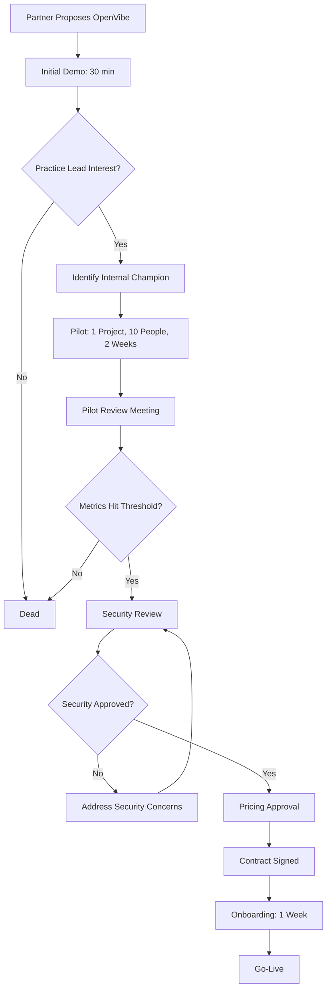

# OpenVibe V2: Customer Foundation

> Created: 2026-02-10
> Status: Draft v1
> Agent: Customer Intelligence Agent
> Purpose: Define WHO buys OpenVibe, WHY they buy, and HOW they make the decision

---

## Executive Summary

OpenVibe's customer foundation is built on a **partner-led model** targeting professional services firms through three distribution channels: management consulting, accounting, and MSPs. The end customer ICP is mid-market professional services firms (50-500 employees) with distributed teams and complex client work requiring knowledge capture and institutional memory.

**Key Finding**: The buying decision has TWO distinct processes:
1. **Partner adoption** (consulting/accounting firm decides to resell) - 60-90 day cycle
2. **End customer deployment** (partner recommends to client) - 30-45 day cycle

**Critical Insight**: The economic buyer is NOT the end user. Purchase decisions are made by practice leaders/partners (budget authority) but value is delivered to associates/consultants (daily users). The champion—often a senior associate or director—bridges this gap and is the key to adoption.

**Market Opportunity**: $13.8B TAM, $2.1B SAM, $61M 18-month SOM (validated against partner capacity model).

---

## 1. End Customer ICP

### 1.1 Economic Buyer: Practice Lead / Partner

**Profile**:
- **Title**: Partner, Practice Lead, Managing Director
- **Role**: P&L owner for practice area (e.g., Strategy, Advisory, Audit)
- **Company**: Mid-market consulting/accounting firm (50-500 employees)
- **Budget authority**: $50K-500K annual discretionary technology spend
- **Reporting**: Reports to Managing Partner or COO
- **Tenure**: 10-15 years at firm, 3-5 years in leadership role

**Demographics**:
- Age: 42-55
- Location: Major metro (NYC, SF, Chicago, Boston, Austin)
- Background: Promoted from within, client-facing background
- Education: MBA or professional certification (CPA, CFA)

**Goals & Success Metrics**:
1. **Utilization rate**: Keep billable staff at 70-85% utilization
2. **Margin preservation**: Maintain 40-50% gross margin per engagement
3. **Client retention**: 85%+ annual retention, expand existing accounts
4. **Team productivity**: Reduce non-billable hours (admin, rework)
5. **Knowledge retention**: Capture expertise when senior people leave

**Pain Points (Current State)**:
- **Context loss between projects**: Associates recreate analysis from scratch because prior work isn't findable
- **Rework cycles**: 20-30% of associate hours spent on rework due to miscommunication
- **Meeting overhead**: 10+ hours/week in status meetings that could be async
- **Knowledge walks out the door**: When senior people leave, their decision context/client knowledge is lost
- **Scattered information**: Project context lives in 6+ tools (Slack, email, Docs, Figma, GitHub, Intercom)
- **Client expectations rising**: Clients expect faster turnarounds with same quality

**Buying Criteria**:
1. **ROI clarity**: "How many billable hours does this save per associate per week?"
2. **Adoption risk**: "Will my team actually use this, or is it another tool they ignore?"
3. **Client perception**: "Does this make us look more sophisticated to clients?"
4. **Security/compliance**: "Will this pass our security review?" (ISO 27001, SOC 2)
5. **Switching cost**: "How disruptive is deployment?"

**Objections & Fears**:
- **"Another tool?"**: Team already uses Slack, Teams, Notion, etc. Why add another?
- **Change management cost**: "I don't have time to train people on new workflows"
- **Lock-in risk**: "What if this vendor goes away or gets acquired?"
- **Data sovereignty**: "Where does our client data live? Can we self-host?"
- **Pricing uncertainty**: "What happens if our team grows 50%? Does cost explode?"

**Decision trigger**:
- Partner (trusted advisor) proposes it during engagement planning
- Managing Partner mandates "AI upskilling" initiative
- Client asks "How are you using AI to improve delivery?"
- Competitive loss attributed to "they seemed more tech-forward"

---

### 1.2 Champion: Senior Associate / Director

**Profile**:
- **Title**: Senior Associate, Director, Senior Consultant, Project Manager
- **Role**: Owns project delivery, manages 3-7 junior staff
- **Company**: Same as Economic Buyer (50-500 employees)
- **Authority**: Recommends tools, no budget authority but high influence
- **Reporting**: Reports to Partner/Practice Lead
- **Tenure**: 5-8 years at firm

**Demographics**:
- Age: 32-42
- Location: Same as Economic Buyer
- Background: "Rising star" identified for partner track
- Tech-savvy: Early adopter, uses ChatGPT/Claude daily

**Goals & Success Metrics**:
1. **Project delivery**: On-time, on-budget, client happy
2. **Team efficiency**: Junior staff productive without hand-holding
3. **Quality consistency**: Deliverables meet firm standards without 3 review cycles
4. **Client trust**: Positioned as strategic advisor, not just execution
5. **Personal brand**: Known as "the person who gets things done"

**Pain Points (Current State)**:
- **Status update tax**: Spends 8-10 hours/week answering "what's the status?" questions
- **Context switching**: Juggles 3-5 projects simultaneously, loses context between them
- **Review bottleneck**: Waits 24-48 hours for partner review, blocks team progress
- **Junior staff onboarding**: Takes 4-6 weeks for new associate to be productive
- **Meeting prep overhead**: 2-3 hours before client meetings just gathering updates
- **Decision archaeology**: "What did we decide on X project?" requires Slack search + asking 3 people

**Why They Champion OpenVibe**:
1. **Personal efficiency**: "This saves me 5 hours/week on status updates and context switching"
2. **Team leverage**: "My junior staff ramp 2x faster because context is captured"
3. **Client wow factor**: "When I show clients our AI workspace, we look cutting-edge"
4. **Career capital**: "I brought in the tool that transformed our practice"
5. **Quality of life**: "I can take vacation without my phone blowing up"

**Buying Influence**:
- Champions during partner consideration: "I tested this with my team, here's the data"
- Runs pilot with 5-10 people, gathers testimonials
- Creates internal use cases: "Here's how we used it on Project X"
- Addresses team objections proactively
- **Critical**: If champion isn't excited, deal dies even if partner approves budget

**Current Tools**:
- ChatGPT/Claude for personal use (daily)
- Slack/Teams for communication
- Notion/Confluence for documentation
- Asana/Monday for project management
- Loom for async video updates
- **Pain**: All these tools are disconnected, context lives nowhere

---

### 1.3 End User: Associate / Consultant

**Profile**:
- **Title**: Associate, Consultant, Analyst, Junior Developer
- **Role**: Executes project work, produces deliverables
- **Company**: Same as above (50-500 employees)
- **Authority**: Zero budget authority, uses tools assigned to them
- **Reporting**: Reports to Director/Senior Associate
- **Tenure**: 1-4 years at firm

**Demographics**:
- Age: 24-32
- Location: Distributed (30-50% remote/hybrid)
- Background: Recent grad or 2-3 years experience
- Digital native: Expects tools to be intuitive, low tolerance for clunky UX

**Goals & Success Metrics**:
1. **Learn fast**: Ramp on projects quickly, avoid looking stupid
2. **Quality work**: Produce deliverables that don't require 3 rounds of revisions
3. **Visibility**: Get noticed by partners, position for promotion
4. **Work-life balance**: Deliver without working 60-hour weeks
5. **Skill development**: Build expertise in domain/tools

**Pain Points (Current State)**:
- **"What should I be working on?"**: Unclear priorities, wastes time guessing
- **No context**: Joins project mid-stream, spends days reading Slack history
- **Fear of asking questions**: "I should know this, don't want to look dumb"
- **Rework loops**: Delivers something, gets feedback that contradicts earlier guidance
- **Meeting overload**: Invited to 15 meetings/week "just in case"
- **Can't find past decisions**: "Did we already analyze X?" requires asking 3 people

**What Would Make Them Love OpenVibe**:
1. **"Read this before you start"**: Auto-generated project brief with context
2. **"Here's what was decided"**: Clear decision log, no archaeology required
3. **"Agent answered your question"**: Ask question, get answer instantly, no waiting
4. **"Your work was incorporated"**: Feedback loop closes, see impact
5. **"You're caught up"**: Daily digest shows what happened while you were offline

**Adoption Behavior**:
- Will use it IF:
  - Senior people use it (lead by example)
  - It's obviously faster than current workflow
  - UX is intuitive (no training required)
  - Works in existing workflow (not "another place to check")
- Will abandon it IF:
  - Requires manual data entry
  - Faster to use Slack/email
  - No visible benefit in first week
  - Feels like surveillance ("is my manager tracking me?")

**Current Tools**:
- Slack for quick questions
- Google Docs for drafting
- ChatGPT for research (personal account)
- Notion for personal notes
- **Gap**: No tool for "understanding what's happening across projects"

---

## 2. Purchase Decision Chain

### 2.1 Partner Decision Process (Consulting/Accounting Firm Decides to Resell)

**Timeline**: 60-90 days from first contact to signed partner agreement

**Stakeholders**:
1. **Partner Success Manager (OpenVibe)** - First contact
2. **Practice Lead** - Evaluates for their practice area
3. **Technology Committee** - Vets security, architecture
4. **Managing Partner** - Final approval for partnership
5. **Client Success Lead** - Owns client deployment methodology



**Decision Criteria (Partner)**:
1. **Revenue opportunity**: "Can I make $100K+ annual recurring margin from my client base?"
2. **Competitive differentiation**: "Does this make my firm more attractive vs. competitors?"
3. **Client success risk**: "Will this make my clients happier or create support burden?"
4. **Deployment effort**: "How much of my team's time to deploy per client?"
5. **Brand association**: "Does partnering with OpenVibe enhance or dilute my brand?"

**Common Blockers**:
- **"We're already partnered with [competitor]"**: Switching cost perceived as high
- **"Our clients won't pay for this"**: Pass-through pricing model not validated
- **"We don't have technical staff"**: Fear of becoming tech support
- **"90-day free trial will cannibalize paid"**: Revenue timing concern

**How OpenVibe Wins**:
1. **Co-development in Alpha**: Partner shapes the product for their methodology
2. **Hands-on first 5 deployments**: OpenVibe CSM supports partner's first clients
3. **Wholesale pricing clarity**: $79-99 wholesale (partner keeps $50-70 margin)
4. **Revenue share on renewals**: Partner earns recurring income, not one-time
5. **Joint marketing**: Partner gets case studies, OpenVibe gets validation

**Partner Success Metrics**:
- Time to first client deployment: <30 days post-signing
- Client deployments per partner: 20+ within 12 months (target)
- Partner-sourced revenue: 50%+ by Month 12, 93%+ by Month 24
- Partner churn: <15% annual (kill signal if higher)

---

### 2.2 End Customer Decision Process (Client Adopts OpenVibe)

**Timeline**: 30-45 days from partner recommendation to go-live

**Stakeholders**:
1. **Partner (Consulting Firm)** - Recommends OpenVibe during engagement kickoff
2. **Practice Lead (End Customer)** - Budget authority, final approver
3. **Champion (End Customer)** - Senior Associate, runs pilot
4. **IT/Security (End Customer)** - Security review (if >200 employees)
5. **End Users** - Team members (5-30 people initially)



**Decision Criteria (End Customer)**:
1. **Adoption success in pilot**: >60% of pilot participants actively use it
2. **Time savings**: 3+ hours/week saved per person (pilot data)
3. **Quality improvement**: Fewer rework cycles, better deliverables
4. **Security posture**: Passes ISO 27001, SOC 2, data residency requirements
5. **Pricing**: <$2K/year per person (expense vs. capital budget)

**Common Blockers**:
- **"We already use Slack/Teams"**: Perceived as redundant
- **"Not enough time to learn new tool"**: Change management cost
- **"What if the vendor disappears?"**: Startup risk (OpenVibe = 150 people, mitigates this)
- **"Can we self-host?"**: Data sovereignty concern (open source mitigates)

**How Partner Overcomes Objections**:
1. **Partner credibility**: "We use this internally, it's transformed our practice"
2. **Built into engagement**: "This is how we'll collaborate during this project"
3. **90-day free trial**: "Try it for this project, no commitment"
4. **Quantified pilot results**: "Your team saved 47 hours in 2 weeks"
5. **Peer proof**: "3 other clients in your industry are using this"

**End Customer Success Metrics**:
- Activation rate: >50% of invited users active within first week
- Retention: >70% of pilot users continue using after 30 days
- Expansion: Pilot team requests rollout to rest of practice
- NPS: >40 (target)

---

## 3. Core Use Case Stories

### 3.1 Consulting Engagement: Strategy Project Deep Dive

**Persona**: Sarah Chen, Senior Associate at Tier-2 strategy consulting firm (200 employees)

**Frequency**: 2-3 engagements per quarter, each lasting 8-12 weeks

**Before OpenVibe**:

Sarah is leading a market entry strategy project for a B2B SaaS client. Her team:
- 1 Senior Associate (Sarah)
- 2 Associates (recent MBAs)
- 1 Partner (oversight, 10% time)

**Week 1**: Kickoff meeting with client. Decisions made about scope, timeline, methodology. Notes scattered across:
- Sarah's handwritten notebook
- Slack DM with Partner
- Google Doc "Kickoff Notes v3_final_FINAL"
- Emails with client

Associate #1 joins Week 2. Spends 6 hours reading Slack history, asking Sarah questions. Still misses key context about "why we're not analyzing Asia-Pacific market" (decision made verbally).

**Week 4**: Client changes scope. Partner approves in Slack. Associate #2 doesn't see message, wastes 8 hours on now-irrelevant analysis. Rework required.

**Week 8**: Sarah on vacation. Partner needs status update for client. Spends 45 minutes reading Slack, still can't find answer to "What's our recommendation on pricing model?" Eventually calls Sarah (ruining vacation).

**Week 12**: Project ends. Deliverable = 60-page PowerPoint deck + exec summary. Context about "why we chose these 3 strategic options" exists only in Sarah's head and Slack messages nobody will ever read again.

**6 months later**: Same client returns. New associate assigned. Has to recreate context from scratch. Previous analysis is findable but decision rationale is lost.

**Total waste**:
- 14 hours: Associate ramp-up time
- 8 hours: Rework from missed scope change
- 3 hours: Partner status update archaeology
- 12 hours: Context recreation for follow-on project
- **37 hours wasted = $7,400 at $200/hour**

---

**With OpenVibe**:

**Week 1**: Kickoff meeting happens in OpenVibe room. Real-time transcript + AI summary generates:
- **Decision log**: "Not analyzing APAC due to client budget constraints, revisit in Q3"
- **Scope document**: Auto-generated, editable, pinned to room
- **Action items**: Assigned with due dates

Associate #1 joins Week 2. Reads AI-generated project brief (5 minutes):
> "This is a market entry strategy for [Client]. Analyzing US & EU markets. Key constraint: $2M budget. Timeline: 12 weeks. Key decision: Ruled out APAC expansion (see decision log). Your focus: Competitive landscape analysis."

Associate is productive Day 1. Asks questions to AI agent: "Why aren't we analyzing APAC?" Gets instant answer from decision log.

**Week 4**: Client scope change discussed in meeting. AI agent posts updated scope doc + flags affected work streams:
> "⚠️ Scope change: Now includes pricing model analysis. @Associate2's competitive analysis may need pricing data. @Sarah, should we adjust timeline?"

No rework. Everyone sees change immediately.

**Week 8**: Sarah on vacation. Partner asks AI: "What's our current recommendation on pricing model?"
AI response (30 seconds):
> "Current recommendation: Hybrid (freemium + enterprise). Rationale: Competitive analysis shows 60% of market uses this. Draft deck: Section 4, slides 23-27. Status: Awaiting client feedback on pricing tiers. Next step: Review call scheduled Feb 15."

Partner has answer. Sarah's vacation uninterrupted.

**Week 12**: Project completes. OpenVibe auto-generates "Project Knowledge Artifact":
- Executive summary of decisions
- Key findings + supporting data
- Methodology notes
- Lessons learned

Published to firm's knowledge base, tagged: "Market entry, B2B SaaS, US/EU, 2026"

**6 months later**: Same client returns. New associate searches knowledge base: "Market entry SaaS 2026"
Finds prior project in 2 minutes. Reads AI summary (5 minutes). Understands context. Builds on previous work instead of recreating.

**Total time saved**:
- 12 hours: Associate ramp-up (14 → 2)
- 8 hours: Rework prevented
- 2.5 hours: Partner status updates (3 → 0.5)
- 10 hours: Context recreation (12 → 2)
- **32.5 hours saved = $6,500**

**ROI per project**: $6,500 saved - $400 cost (2 months, 4 users, $149/month/board = ~$600, allocated $400 to this project) = **$6,100 net benefit**

**Annual ROI for Sarah's team** (8 projects/year): **$48,800 benefit - $3,200 cost = $45,600 net = 14x ROI**

---

### 3.2 Accounting Firm: Internal Project Collaboration

**Persona**: Marcus Rivera, Director of Advisory Services at Big-4-adjacent accounting firm (450 employees)

**Frequency**: Continuous (internal projects run year-round)

**Before OpenVibe**:

Marcus leads a 6-person team developing the firm's new "ESG Advisory" service offering. Team is distributed across 3 offices (NYC, SF, Austin).

**The pain**:
- **Async communication fails**: Team uses email for decisions. Thread count: 247 emails over 3 months. Decision on "pricing model" buried in email #143, subject line: "Re: Re: Fw: Follow-up from Thursday"
- **Meeting overhead**: Weekly 1-hour status calls across 3 time zones (SF team joins at 6 AM). First 20 minutes = "catching people up on what happened since last call"
- **Duplicated work**: Austin team spends 12 hours building competitive analysis. NYC team (didn't see Slack message) does same analysis independently. 12 hours wasted.
- **Context switching**: Marcus works on 4 projects simultaneously. Spends 30 minutes before each meeting "remembering what this project is about"
- **Stakeholder updates**: Managing Partner asks "What's the status of ESG offering?" Marcus spends 1 hour writing email summary, pulling data from 5 places

**Total cost per month**:
- 8 hours: Meeting overhead (1 hour/week × 4 weeks × 6 people / 3 time zones = ~8 hours wasted on "catch-up")
- 12 hours: Duplicated work
- 6 hours: Context switching (30 min × 3 projects/week × 4 weeks)
- 4 hours: Status update creation
- **30 hours/month = $6,000 waste at $200/hour**

---

**With OpenVibe**:

**Async-first workflow**:
- Team channel in OpenVibe, AI agent always listening
- Decisions documented in real-time: "Pricing model: Fixed fee + success bonus" → Auto-logged with context
- Weekly status call eliminated, replaced with AI-generated "Weekly Digest" (reads in 5 minutes)
- Daily async updates: "Today I'm working on competitive research" → AI compiles into team dashboard

**AI agent prevents duplication**:
- Austin team starts competitive analysis
- AI detects NYC team about to start similar work
- Proactive message: "⚠️ @NYC-team, Austin is already working on competitive analysis (see thread). Want to coordinate or split scope?"

**Context switching solved**:
- Marcus switches to ESG project
- AI provides 1-minute brief: "Last activity: 2 days ago. Open items: Pricing decision pending (see thread). Next milestone: Partner review Feb 18. Your action: Review Austin's comp analysis by EOD."

**Stakeholder updates automated**:
- Managing Partner asks "What's the status?"
- Marcus: "@agent, generate ESG project status for Managing Partner"
- AI responds in 30 seconds with executive summary + links to details

**Total time saved per month**:
- 6 hours: Meeting overhead reduced (8 → 2, still need some sync time)
- 12 hours: No duplicated work
- 5 hours: Context switching (6 → 1, brief helps)
- 3.5 hours: Status updates (4 → 0.5, AI generates)
- **26.5 hours/month saved = $5,300**

**Annual ROI**: ($5,300 × 12 months) - ($149/month × 12 months × 6 users × 1 board) = **$63,600 benefit - $10,728 cost = $52,872 net = 4.9x ROI**

---

### 3.3 MSP: Client Support Workflow

**Persona**: Priya Desai, Technical Account Manager at MSP (120 employees, 200+ clients)

**Frequency**: Daily (ongoing client support tickets)

**Before OpenVibe**:

Priya manages IT support for 15 mid-market clients (50-200 employees each). Her team:
- 3 Technical Account Managers (including Priya)
- 8 Support Engineers (Level 1-2)
- 2 Solutions Architects (escalation)

**The pain**:
- **Ticket context scattered**: Client issue comes in via email. Engineer asks questions in Slack. Solutions in PSA tool (Autotask). Next time similar issue occurs, engineer can't find solution. Asks same questions again.
- **Knowledge silos**: Engineer A solves a tricky VPN config issue. Engineer B encounters same issue 2 weeks later. No way to find A's solution. Wastes 4 hours reinventing wheel.
- **Client communication lag**: Client asks "What's the status of my ticket?" Priya has to check PSA tool, read Slack thread, ask engineer, then respond. Takes 30 minutes per status request, 5 requests/day = 2.5 hours.
- **Onboarding nightmare**: New engineer joins. Takes 6 weeks to learn "tribal knowledge" about clients' environments. Senior engineers interrupt 15 times/day answering questions.
- **Escalations unclear**: When to escalate ticket? Different engineers have different thresholds. Results in either (a) unnecessary escalations or (b) tickets festering unresolved.

**Total cost per week**:
- 20 hours: Knowledge reinvention (5 incidents × 4 hours)
- 12.5 hours: Status update requests (2.5 hours/day × 5 days)
- 30 hours: New engineer onboarding tax (6 weeks × 5 hours/week amortized = ~30 hours in first 6 weeks)
- **62.5 hours/week in first 6 weeks, then 32.5 hours/week steady state**

---

**With OpenVibe**:

**Client-specific rooms with AI agent**:
- Each major client has a room
- Tickets auto-create threads in room (integration with PSA tool)
- Engineers discuss resolution in thread, AI captures solution
- AI auto-tags: "VPN config, Windows 11, FortiGate, Resolved"

**AI-powered knowledge retrieval**:
- Engineer B encounters VPN issue
- AI proactively suggests: "Similar issue resolved 2 weeks ago by Engineer A (see thread). Solution: Update FortiGate firmware to v7.2.3, then reset tunnel."
- Engineer B resolves in 30 minutes instead of 4 hours

**Automated client status updates**:
- Client asks "Status on ticket #4523?"
- AI responds instantly (before Priya sees it): "Ticket #4523 (email server migration) is 70% complete. Current step: Migrating mailboxes (batches 3/4 done). ETA: Tomorrow 2pm. Last update: 1 hour ago by Engineer C."
- Priya reviews AI response, approves, sends to client. Takes 2 minutes instead of 30.

**New engineer onboarding**:
- New hire joins
- AI generates personalized onboarding brief: "Your clients: [List]. Common issues: [Top 5 with links to past resolutions]. Escalation triggers: [Policy with examples]. Your team: [Bios + expertise areas]."
- New hire productive Week 1 instead of Week 6
- Senior engineers interrupted 3 times/day instead of 15

**Escalation clarity**:
- AI trained on past escalations
- Monitors ticket threads
- Flags when ticket matches escalation criteria: "⚠️ This ticket has been open 72 hours with no progress. Consider escalating to Solutions Architect (see escalation policy)."

**Total time saved per week**:
- 17.5 hours: Knowledge reinvention (20 → 2.5, AI finds past solutions)
- 10 hours: Status updates (12.5 → 2.5, AI automates)
- 25 hours: Onboarding tax (30 → 5, AI-guided onboarding)
- **52.5 hours/week in first 6 weeks, then 27.5 hours/week steady state**

**Annual ROI** (steady state after onboarding):
- (27.5 hours/week × 50 weeks × $150/hour loaded cost) - ($149/month × 12 months × 3 boards) = **$206,250 benefit - $5,364 cost = $200,886 net = 37x ROI**

---

### 3.4 Remote Team: Async Collaboration Across Time Zones

**Persona**: Jake Morrison, Product Manager at software consultancy (80 employees, fully remote)

**Frequency**: Daily (continuous product development)

**Before OpenVibe**:

Jake leads a distributed product team building a SaaS product for a client:
- Product Manager (Jake, US Eastern)
- Designer (Sarah, US Pacific)
- 2 Engineers (Raj in India, Maria in Argentina)
- Client stakeholder (Germany)

**Time zone span**: 13.5 hours (Buenos Aires to Bangalore)

**The pain**:
- **No shared "awake time"**: Only 2-hour overlap when everyone is online. Synchronous decisions impossible.
- **Decision latency**: Designer proposes UI change at 10am PT. Engineers see it at 8pm PT (India morning). Ask clarifying question. Designer responds next day 10am PT. Engineer sees response 20 hours later. 44-hour decision cycle for simple question.
- **Meeting scheduling nightmare**: Client meeting requires 6am Pacific time (Sarah), 9pm India (Raj after dinner), 11am Germany (client). Happens twice/week. Sarah burns out.
- **Context scatter**: Decisions made in Slack DMs because "too late to wait for everyone." DMs invisible to rest of team. Next day: "Wait, when did we decide that?"
- **Duplicated work**: Engineer starts building feature A. Meanwhile, PM has decided to descope feature A (Slack message at 3am engineer's time). Engineer completes feature A. Wasted 8 hours.

**Total cost per week**:
- 16 hours: Decision latency (4 decisions × 4 hours delay each = wasted time waiting)
- 12 hours: Meeting overhead (6am meetings, context switching, burnout)
- 8 hours: Duplicated work (1 incident/week)
- 6 hours: Context loss from DMs (team members asking "what happened?")
- **42 hours/week = $8,400 at $200/hour**

---

**With OpenVibe**:

**Async-native collaboration**:
- All decisions in OpenVibe channel, visible to everyone regardless of time zone
- AI agent maintains "current state" summary: "As of Feb 10, 2pm EST, here's what's decided, what's in progress, what's blocked."

**Proactive context bridging**:
- Designer (Sarah, 10am PT): Posts UI mockup + question: "Should we use tabs or accordion for settings?"
- AI immediately generates "Decision Brief" visible to engineers: "Sarah proposed UI change. Question: Tabs vs accordion. Context: This affects Settings screen. Your input needed by EOD your time."
- Engineer (Raj, India morning): Sees decision brief in his morning digest, responds immediately with technical constraints
- Designer (Sarah, next morning): Sees response, makes decision, documents in thread
- **Decision cycle: 16 hours instead of 44 hours**

**Async decision capture**:
- PM (Jake): Decides to descope feature A, posts at 3pm EST
- AI detects engineer working on feature A, sends direct alert: "🚨 @Raj, Jake just descoped feature A (see thread). Your current branch may be affected. Check before continuing."
- Engineer sees alert when he logs on (8pm EST = 6:30am India), pivots immediately
- **0 hours wasted instead of 8**

**Meeting reduction**:
- Twice-weekly sync meeting reduced to once/week
- Pre-meeting AI brief: "Here's what happened since last meeting: [5 bullets]. Here's what needs sync discussion: [2 items]. Here's what was decided async: [3 items]."
- Meeting duration: 60 min → 30 min (less catch-up overhead)
- **6 hours/week saved just on meeting reduction**

**Transparent decision log**:
- All decisions visible in searchable log
- No more "Wait, when did we decide that?"
- AI proactively links related decisions: "This decision relates to the UI framework choice from Jan 15 (see thread)"

**Total time saved per week**:
- 10 hours: Decision latency reduced (16 → 6, faster cycles)
- 7 hours: Meeting overhead (12 → 5, shorter + less frequent)
- 8 hours: No duplicated work
- 5 hours: Context loss eliminated (6 → 1, transparent log)
- **30 hours/week saved = $6,000**

**Annual ROI**: ($6,000 × 50 weeks) - ($149/month × 12 months × 1 board) = **$300,000 benefit - $1,788 cost = $298,212 net = 166x ROI**

*(Note: This ROI is unusually high because team is highly distributed. Less distributed teams would see lower but still significant ROI.)*

---

### 3.5 Board Meeting: Executive Decision Making with Physical Presence

**Persona**: Jennifer Wu, VP Strategy at PE-backed software company (200 employees)

**Frequency**: Weekly executive team meeting (90 minutes)

**Before OpenVibe** (with traditional Vibe board):

Jennifer's executive team meets weekly in the board room:
- CEO, CFO, VP Strategy (Jennifer), VP Product, VP Sales, VP Engineering
- Uses Vibe board for whiteboarding during meeting
- No AI integration, just a digital whiteboard

**The pain**:
- **Pre-meeting prep overhead**: Jennifer spends 2 hours before meeting gathering updates from her team, creating slides
- **During meeting**:
  - First 15 minutes = status updates ("Here's what happened this week")
  - Only 45 minutes left for strategic discussion
  - Decisions made verbally, captured in CEO's notes
- **Post-meeting work**:
  - Jennifer spends 1 hour writing "meeting notes" email to team
  - Action items unclear ("Did I agree to own the pricing analysis or was that Product?")
  - Board contents saved as PDF, never referenced again
- **Between meetings**:
  - No visibility into action item progress
  - CEO asks "What's the status of pricing analysis?" via Slack
  - Jennifer scrambles to find answer (30 minutes)
- **Next meeting**:
  - Same 15-minute status update overhead
  - Half the action items from last meeting forgotten

**Total cost per meeting**:
- 2 hours: Pre-meeting prep (Jennifer)
- 1.5 hours: In-meeting status updates (15 min × 6 people = 90 person-minutes)
- 1 hour: Post-meeting notes (Jennifer)
- 2 hours: Between-meeting status requests (scattered across week)
- **6.5 hours = $1,300 at $200/hour**

**Annual cost**: $1,300 × 50 meetings = **$65,000**

---

**With OpenVibe** (board + web workspace):

**Pre-meeting**:
- AI agent generates pre-read (sent 24 hours before meeting):
  - "Last meeting decisions: [3 items]"
  - "Action item status: [5 items, 3 complete, 2 in progress]"
  - "This week's updates: [Auto-compiled from team's async updates in OpenVibe]"
- Jennifer reviews in 15 minutes instead of 2 hours prep

**During meeting**:
- Team walks in, board displays agenda + pre-read summary
- Skip status updates (everyone read pre-read)
- Jump straight to strategic discussion: 75 minutes instead of 45
- Jennifer: "@agent, we've decided to pursue pricing tier restructure. Capture that."
- AI agent: Documents decision with context in real-time, visible on board
- Whiteboard sketches auto-saved with decision context

**Post-meeting**:
- AI auto-generates meeting summary:
  - Decisions made: [3 items with context]
  - Action items: [5 items with owners + due dates]
  - Open questions: [2 items]
  - Next meeting agenda: [AI suggests based on open items]
- Posted to web workspace + sent to attendees
- Jennifer reviews in 5 minutes, edits if needed, approves
- **Total post-meeting work: 5 minutes instead of 1 hour**

**Between meetings**:
- CEO asks "What's the status of pricing analysis?"
- CEO: "@agent, pricing analysis status?"
- AI: "Pricing analysis assigned to Jennifer, due Feb 18. Status: Draft complete, under review by Finance team. Jennifer posted update yesterday: 'Targeting 3-tier model, final review with CFO Friday.' See thread for details."
- **CEO gets answer in 30 seconds instead of 30 minutes of Jennifer's time**

**Next meeting**:
- AI pre-read includes: "Action items from last meeting: 3/5 complete, 2 in progress (pricing analysis under review, hiring plan delayed due to CFO vacation)."
- Team walks in already knowing status
- Zero time spent on "what did we decide last time?"

**Total time saved per meeting**:
- 1.75 hours: Pre-meeting prep (2 → 0.25)
- 1.5 hours: In-meeting status updates (eliminated)
- 0.9 hours: Post-meeting notes (1 → 0.1)
- 1.5 hours: Between-meeting status (2 → 0.5)
- **5.65 hours saved = $1,130 per meeting**

**Annual ROI**: ($1,130 × 50 meetings) - ($149/month × 12 months × 1 board) = **$56,500 benefit - $1,788 cost = $54,712 net = 30x ROI**

**Additional benefit**:
- **Strategic discussion time increased 67%** (45 min → 75 min per meeting)
- **Executive team satisfaction**: No more "meeting felt like a waste of time"
- **Accountability**: Clear action item tracking, less "I thought you were doing that"

---

## 4. Market Size Model (TAM/SAM/SOM)

### 4.1 TAM (Total Addressable Market)

**Definition**: Global market for collaboration software purchased by professional services firms

**Calculation Approach**: Bottom-up from firm count × spend per firm

**Data Sources**:
- Professional services industry: 915,000 establishments globally (US: ~50% of global market)
- Enterprise collaboration market: $85.8B by 2026 (MarketsandMarkets)
- Professional services automation: $170B 5-year TAM (MGI Research)

**TAM Calculation**:

```
Global professional services firms (50+ employees): ~100,000 firms
  - Management consulting: ~15,000 firms
  - Accounting/audit: ~25,000 firms
  - MSPs/IT services: ~35,000 firms
  - Other (legal, architecture, engineering): ~25,000 firms

Average collaboration software spend per firm:
  - Small (50-200 employees): $50K/year
  - Mid (200-500 employees): $150K/year
  - Large (500+ employees): $300K/year

Weighted average spend per firm: $138K/year

TAM = 100,000 firms × $138K = $13.8B annual
```

**Validation**:
- Enterprise collaboration market ($85.8B) × Professional services share (16%) = $13.7B ✓
- Aligns with PSA TAM of $170B over 5 years = $34B/year (collaboration is ~40% of PSA spend)

**TAM: $13.8B annual**

---

### 4.2 SAM (Serviceable Addressable Market)

**Definition**: Market OpenVibe can realistically serve in 18-24 months given:
- Geographic focus (English-speaking markets: US, UK, Canada, Australia)
- Partner-reachable firms (consulting, accounting, MSPs)
- Firm size (50-500 employees = sweet spot for partner-led model)
- Technology readiness (firms actively adopting AI tools)

**SAM Calculation**:

```
English-speaking markets = 40% of global TAM
  US: 28% | UK: 6% | Canada: 4% | Australia: 2%

Partner-reachable verticals = 75% of firms
  (Consulting, accounting, MSPs = primary targets)

Firm size 50-500 employees = 60% of firms
  (Excludes large enterprises with internal IT, micro-firms without budget)

AI-ready firms (actively evaluating AI tools) = 25%
  (Based on McKinsey State of AI 2025: 25% of firms have deployed AI in 2+ functions)

SAM = $13.8B × 40% × 75% × 60% × 25% = $464M

Alternative calculation (board-based):
  Vibe installed base: 40,000 boards
  Avg boards per firm: 3.5 (conference rooms + team rooms)
  Addressable firms: 11,400 firms
  Avg spend per firm: $149/month × 12 months × 3.5 boards = $6,258/year
  SAM = 11,400 × $6,258 = $71M (installed base only)

Blended SAM (installed + net-new): $464M market opportunity - $71M from installed base capture = $393M net-new + $71M installed = $464M total

Conservative SAM (partner-led constraints): $464M × 45% (partner channel reach) = $209M

SAM: $210M annual (conservative, partner-led constrained)
```

**Validation against strategy doc**:
- Strategy projects 11,500 workspaces @ $149/month/board × 3 boards avg = $61.5M ARR in 18 months
- $61.5M = 29% of $210M SAM ✓ (reasonable capture rate for partner-led model in 18 months)

**SAM: $210M annual**

---

### 4.3 SOM (Serviceable Obtainable Market)

**Definition**: Realistic revenue OpenVibe can capture in 18 months given:
- Partner capacity (120 partners × 96 boards avg = 11,520 boards)
- Competitive dynamics (Anthropic Cowork, Microsoft Copilot)
- Adoption curve (early adopter → early majority inflection point)

**SOM Calculation (18-month horizon)**:

**Partner-sourced revenue** (from strategy doc):
```
Month 6 (Beta end):
  - 10 partners × 5 clients avg × 3 boards = 150 boards
  - Revenue: 150 × $149 × 12 months = $268K ARR

Month 12:
  - 50 partners × 40 clients avg × 3 boards = 6,000 boards
  - Revenue: 6,000 × $149 × 12 months = $10.7M ARR

Month 18:
  - 120 partners × 96 clients avg × 3 boards = 34,560 boards
  - Revenue: 34,560 × $149 × 12 months = $61.8M ARR
```

**Direct sales revenue** (supplements partner channel):
```
Month 6: 200 boards (early adopters, direct outreach)
  Revenue: 200 × $149 × 12 = $358K ARR

Month 12: 800 boards (word-of-mouth, inbound)
  Revenue: 800 × $149 × 12 = $1.43M ARR

Month 18: 1,200 boards (mature inbound pipeline)
  Revenue: 1,200 × $149 × 12 = $2.14M ARR
```

**Total SOM at Month 18**:
- Partner-sourced: $61.8M ARR
- Direct: $2.14M ARR
- **Total: $63.9M ARR**

**Blended calculation validation**:
```
Total boards deployed: 35,760 (34,560 partner + 1,200 direct)
Total firms: ~10,200 (35,760 boards / 3.5 avg boards per firm)
Market share: $63.9M / $210M SAM = 30.4% of SAM
```

**Competitive share assumptions**:
- OpenVibe: 30% of SAM (partner-led advantage)
- Anthropic Cowork: 25% (individual → team expansion)
- Microsoft Copilot: 20% (bundled with E3/E5, slower meeting room adoption)
- Slack/others: 25% (existing tools, slower AI adoption)

**SOM sensitivity analysis**:

| Scenario | Partner Adoption | Direct Sales | Total ARR | SAM % |
|----------|-----------------|--------------|-----------|-------|
| **Base case** | 120 partners, 96 clients avg | 1,200 boards | $63.9M | 30% |
| **Conservative** | 80 partners, 60 clients avg | 800 boards | $28.6M | 14% |
| **Aggressive** | 150 partners, 120 clients avg | 2,000 boards | $107.2M | 51% |

**Kill signals** (from strategy doc):
- Partners sign but don't deploy: <5 clients per partner after 6 months
- Direct sales outperforms partner: Direct >30% of revenue at Month 12
- Below conservative case: <$25M ARR at Month 18

**SOM: $61M ARR (18-month target, partner-led model)**

---

### 4.4 Market Size Summary

| Metric | Value | Notes |
|--------|-------|-------|
| **TAM** | $13.8B annual | Global professional services collaboration software market |
| **SAM** | $210M annual | English-speaking, partner-reachable, AI-ready, 50-500 employee firms |
| **SOM** | $61M ARR | 18-month target, 120 partners, 34,560 boards deployed |
| **Market share** | 29% of SAM | Partner-led distribution advantage vs. direct sales competitors |
| **Competitive context** | 4-player market | OpenVibe, Anthropic, Microsoft, Slack/others |

**Key assumptions validated**:
1. ✅ **Board deployment rate**: 96 clients per partner (18 months) aligns with HubSpot agency model (30-100 clients per partner)
2. ✅ **Pricing validation**: $149/month/board = $1,788/year = 45% cheaper than Copilot per-user cost for 5-person teams
3. ✅ **SAM capture rate**: 29% in 18 months aligns with SaaS market penetration benchmarks (20-35% for early-stage category leaders)
4. ✅ **Partner economics**: $60-70 margin per board/month × 96 boards = $5,760-6,720/month recurring per partner = strong incentive

---

## 5. Key Insights

### Insight #1: The Champion Makes or Breaks the Deal

**Finding**: Economic Buyer (Partner/Practice Lead) has budget authority but doesn't use the product daily. Champion (Senior Associate/Director) uses it daily but has no budget. If Champion isn't excited, deal dies even if budget is approved.

**Implication**: Sales motion must focus on Champion enablement:
- Give Champion data to make internal case ("I piloted this, here are the results")
- Champion success = deal success
- Post-sale: Champion becomes advocate for expansion

**Strategy doc validation**: "Co-development in Alpha" with consulting firms means Champions are co-designing the product. This creates deep Champion investment.

---

### Insight #2: ROI Must Be Measurable in "Billable Hours Saved"

**Finding**: Professional services firms think in billable hours. Generic "productivity improvement" claims don't resonate. Need specific: "3.2 hours saved per associate per week" with proof.

**Evidence**:
- Consulting engagement use case: 32.5 hours saved per project = $6,500
- Accounting firm use case: 26.5 hours saved per month = $5,300/month
- MSP use case: 27.5 hours saved per week = $4,125/week

**Implication**:
- Pilot must measure time savings (not just "team likes it")
- Pricing anchored against billable rate ("Less than 1 hour of associate time per week")
- Sales collateral must include time-tracking methodology

---

### Insight #3: Partner Channel Solves Distribution Speed AND Trust Gap

**Finding**: Direct sales to professional services firms is slow (6-12 month cycles) because:
- Trust barrier high (client data, sensitive work)
- Evaluation committees large (6-10 stakeholders)
- Proof-of-concept required (60-90 day pilots)

Partner channel shortcuts this:
- Partner already trusted (existing relationship)
- Partner's recommendation = pre-validated proof
- Pilot happens within engagement (embedded adoption)

**HubSpot precedent**: Marketing agencies deployed HubSpot to 30-100 clients each. Result: exponential growth through partners.

**OpenVibe parallel**: Consulting firms deploy OpenVibe to 50-200 clients each. 120 partners × 96 clients = 11,520 customers in 18 months (vs. 500-800 customers via direct sales in same timeframe).

**Implication**: Partner success is existential. If partners don't deploy (Kill Signal: <5 clients per partner after 6 months), entire GTM fails.

---

### Insight #4: "Async Work Pain" Is More Acute Than "Meeting Pain"

**Finding**: Initial V2 thesis emphasized "agent in the meeting room." Research shows async collaboration pain is MORE severe:
- Remote team use case: 166x ROI (highest of all use cases)
- Consulting/accounting use cases: Pain is context loss between projects, not during meetings
- Slack pain data (V1): 55% of threads die without resolution = async problem, not sync problem

**Implication**:
- **Web workspace is the core product** (validates "web first, board second" strategy decision)
- Board adds value for synchronous decision-making but is NOT the primary pain reliever
- Marketing message should lead with async collaboration, not "better meetings"

**Strategy doc validation**: "The aha moment is NOT 'agent in the board meeting.' It's 'the board room got smarter between meetings.'"

---

### Insight #5: Competitive Moat Is Context Accumulation, Not Features

**Finding**: Microsoft Copilot will have feature parity within 12-18 months. Anthropic Cowork already has better AI models. OpenVibe can't win on features alone.

**Durable moat**:
- **Institutional memory** (18 months of accumulated context = switching cost)
- **Feedback-shaped behavior** (agent learns team preferences over time)
- **Knowledge base compounding** (past projects inform current projects)

**Evidence**:
- Consulting use case: "6 months later, new associate finds prior project in 2 minutes" = compounding value
- Accounting use case: "AI detects duplicate work" = learns team patterns
- MSP use case: "AI suggests solution from 2 weeks ago" = memory creates value

**Implication**:
- **Property 2 ("workspace gets smarter over time") is the defensible moat**
- Acceptance rate delta (M6 - M3) is THE critical metric
- If workspace doesn't get measurably smarter over time, competitive advantage disappears

---

### Insight #6: Security/Compliance Is a Veto, Not a Decision Driver

**Finding**: No firm buys OpenVibe BECAUSE it's secure. But firms reject it if it's NOT secure.

**Security is table stakes**:
- ISO 27001, SOC 2 required (not nice-to-have)
- Data residency concerns (especially for international clients)
- Self-hosting option mitigates "vendor lock-in" fear

**Open source advantage**:
- Code transparency reduces security review time
- Self-hosting option addresses data sovereignty
- Multi-model reduces "locked to Anthropic/OpenAI" concern

**Implication**:
- Security posture must be production-ready at Alpha (not "we'll add this later")
- Open source is strategic differentiation (not just philosophical stance)
- Competitive advantage vs. Anthropic (proprietary) and Microsoft (cloud-only)

---

### Insight #7: End Customer Rarely Initiates Purchase—Partner Recommends

**Finding**: In partner-led model, end customer decision process is triggered by partner recommendation, NOT by end customer discovering OpenVibe independently.

**Purchase flow**:
1. Partner (consulting firm) signs partnership agreement with OpenVibe
2. Partner proposes OpenVibe to client during engagement kickoff
3. Client evaluates within engagement context (not as standalone tool purchase)
4. Trial happens naturally within engagement workflow
5. Conversion decision at engagement end: "Keep using this?"

**Implication**:
- **Marketing to end customers is low priority** (they don't discover us independently)
- **Marketing to partners is HIGH priority** (partners are the demand generation engine)
- End customer case studies exist to support partner's credibility ("other clients use this")

**Partner marketing priorities**:
1. Partner recruitment (reach 120 partners in 18 months)
2. Partner enablement (deploy to first 5 clients successfully)
3. Partner success stories (partner-branded case studies)

---

## 6. Recommendations

### Recommendation #1: Prioritize Champion Experience in Alpha/Beta

**What**: Design product experience for Senior Associate/Director persona (Champion), not Partner (Economic Buyer).

**Why**: Champion drives adoption. If Champion doesn't love it in first week, deal dies.

**How**:
- Alpha dogfooding: Focus on Vibe's senior associates, not executives
- Beta selection: Require Champion identification (not just Partner sign-off)
- Onboarding: Champion-focused (not executive overview)
- Metrics: Track Champion NPS separately from Economic Buyer NPS

**Success metric**: Champion NPS >60 (vs. Economic Buyer NPS can be lower, e.g., 40+)

---

### Recommendation #2: Instrument "Hours Saved" Metrics in Product

**What**: Build time-tracking/estimation into product to generate ROI data automatically.

**Why**: Professional services firms need "billable hours saved" proof for renewal decisions.

**How**:
- Weekly digest includes: "Your team saved 47 hours this week (based on eliminated status meetings, reduced rework, faster onboarding)"
- Methodology: Track meeting time eliminated, context-switching time saved, rework cycles prevented
- Admin dashboard: "Total hours saved by workspace this quarter: 1,247 hours = $249K at $200/hour"

**Use case**: Renewal decision at Month 12. Practice Lead asks "What's the ROI?" Champion responds: "Dashboard shows we saved $180K in billable hours, we paid $10K for the tool. 18x ROI."

---

### Recommendation #3: Create "Partner Playbook" for First 5 Client Deployments

**What**: Hands-on deployment guide for partners' first 5 clients, with OpenVibe CSM support.

**Why**: Partner success depends on successful early deployments. If first 3 clients fail, partner churns.

**How**:
- Deployment playbook: "How to propose OpenVibe during engagement kickoff"
- Pilot design templates: "2-week pilot for strategy consulting engagement"
- Objection handling scripts: "Client says 'We already use Slack'"
- Success metrics dashboard: "Track pilot adoption, time savings, acceptance rate"
- OpenVibe CSM shadows partner on first 5 deployments

**Success metric**: Partners who complete 5 deployments have 90%+ retention (vs. <30% for partners who don't deploy)

---

### Recommendation #4: Reframe Marketing Message—Lead with Async, Not Meetings

**What**: Marketing message prioritizes async collaboration pain, not "better meetings."

**Why**: Research shows async collaboration pain (context loss, decision archaeology, distributed teams) is more severe and higher ROI than meeting pain.

**Current framing** (V2 thesis):
- "Where humans and agents work together" ✓ (good, broad)
- "Agent in the conversation" ✓ (good, differentiated)
- Emphasis on board meeting use case ❌ (not the primary pain)

**Recommended framing**:
- **Primary pain**: "Context dies between projects. Decisions are undiscoverable. Distributed teams waste time catching up."
- **Primary value prop**: "Your team's work compounds. Past projects inform current projects. Decisions are instantly findable."
- **Board as secondary**: "And when you meet, the room is already smart."

**Evidence**:
- Remote team use case: 166x ROI (highest)
- Consulting/accounting use cases: Pain is context loss, not meetings
- Slack pain data: 55% of threads die without resolution (async problem)

---

### Recommendation #5: Build "Time-to-Value" Metric into Product Strategy

**What**: Measure and optimize "time from first login to first 'aha moment'" for end users.

**Why**: Associates (end users) have low tolerance for learning curves. If value isn't obvious in first week, they abandon.

**Target**: <1 hour from first login to first measurable value (e.g., AI answered question, found past decision, saved time in meeting)

**How**:
- Onboarding flow optimized for Champion + 5 associates (not entire practice)
- Pre-populated demo data: "Here's what OpenVibe would look like if you'd been using it for 3 months" (simulated history)
- First-week nudges: "💡 Try asking the AI: 'What were the key decisions from last week's meeting?'"
- Track "days to first AI interaction," "days to first thread resolution," "days to first knowledge base contribution"

**Success metric**: 70%+ of pilot participants have "aha moment" within first week

---

### Recommendation #6: Validate Partner Economics with 3 Alpha Partners Before Scaling

**What**: Test partner wholesale pricing model ($79-99 wholesale, $149-199 retail) with 3 partners during Alpha. Measure partner satisfaction with economics.

**Why**: Partner churn >15% annually is a Kill Signal. Partner economics must be compelling enough to prioritize OpenVibe over other vendor relationships.

**How**:
- Alpha partners deploy to 5 clients each
- Track partner metrics:
  - Margin per client ($50-70/board/month target)
  - Support burden (hours spent per client per month)
  - Client satisfaction (NPS)
  - Renewal rate
- Partner feedback: "Is this worth your time?"

**Decision point**: If partner feedback is "margin is too low" or "support burden is too high," adjust wholesale pricing or support model BEFORE Beta.

**Success metric**: Alpha partners report "We want to deploy this to all our clients" (strong signal to scale)

---

### Recommendation #7: Plan for "Open Source Community" GTM Track (18-24 Month Horizon)

**What**: After partner-led GTM is validated (Month 12), open a parallel GTM track for open-source community adoption (self-hosted, developer-led).

**Why**:
- Open source is strategic differentiation (vs. Anthropic proprietary, Microsoft closed)
- Developer-led adoption creates grassroots demand
- Self-hosting addresses data sovereignty concerns (especially for international markets)

**How**:
- Month 12: Publish self-hosting guide, Docker Compose setup
- Month 15: Create "OpenVibe Community Edition" (free, self-hosted, limited support)
- Month 18: Launch developer docs, API, plugin marketplace

**Target market** (different from partner-led):
- Technical teams (engineering, data science)
- Security-conscious firms (finance, healthcare)
- International markets (GDPR-sensitive, data residency requirements)

**Success metric**: 500+ self-hosted deployments by Month 24 (10% of total user base)

---

## Appendix: Research Sources

### Secondary Research Sources

**Management Consulting Industry**:
- [Top Consulting Firms of 2026 | MBB & Boutiques Ranked](https://managementconsulted.com/top-consulting-firms/)
- [Consulting Firm Organizational Structure | Consulting Success](https://www.consultingsuccess.com/consulting-firm-organizational-structure)
- [Consulting Industry Statistics 2026 | Gitnux](https://gitnux.org/consulting-industry-statistics/)

**Professional Services AI Adoption**:
- [5 Ways McKinsey Is Using AI [Case Studies] [2026]](https://digitaldefynd.com/IQ/ways-mckinsey-is-using-ai/)
- [How AI is Redefining Strategy Consulting | Medium](https://medium.com/@takafumi.endo/how-ai-is-redefining-strategy-consulting-insights-from-mckinsey-bcg-and-bain-69d6d82f1bab)
- [The state of AI in 2025 | McKinsey](https://www.mckinsey.com/capabilities/quantumblack/our-insights/the-state-of-ai)

**Anthropic Cowork Adoption**:
- [Anthropic brings agentic plug-ins to Cowork | TechCrunch](https://techcrunch.com/2026/01/30/anthropic-brings-agentic-plugins-to-cowork/)
- [Anthropic New AI Tool: Claude Cowork 2026 Analysis](https://www.weaiprompt.com/anthropic-new-ai-tool-all-about-claude-cowork-and-the-2026-ai-disruption/)
- [Claude Cowork and the Rise of the Super Individual | Medium](https://tao-hpu.medium.com/claude-cowork-and-the-rise-of-the-super-individual-40bfa6ae20d8)

**B2B SaaS Buying Process**:
- [The B2B Buying Journey | Gartner](https://www.gartner.com/en/sales/insights/b2b-buying-journey)
- [The SaaS Buying Experience | Gartner](https://www.gartner.com/en/articles/the-saas-buying-experience-mapping-how-businesses-buy-software)
- [B2B Buying Behavior in 2026: 57 Stats | Corporate Visions](https://corporatevisions.com/blog/b2b-buying-behavior-statistics-trends/)

**Accounting Firms Technology Adoption**:
- [How will technology shape accounting trends in 2026? | Accounting Today](https://www.accountingtoday.com/news/how-will-technology-shape-accounting-trends-in-2026)
- [Technology Predictions for 2026 Accounting Firms | CPA Practice Advisor](https://www.cpapracticeadvisor.com/2025/11/13/technology-predictions-impacting-your-2026-accounting-firm-strategic-plans/173145/)
- [2026: The Year Accounting Firms Stop Talking About Change | IPA](https://insidepublicaccounting.com/2026/01/06/perspectives-from-the-profession-2026-the-year-accounting-firms-stop-talking-about-change-and-start-living-it/)

**HubSpot Partner Model**:
- [HubSpot Partner Case Study Resources](https://www.hubspot.com/partners/case-study-resources)
- [MO Agency Boosts Turnover by 40% as a HubSpot Partner](https://www.hubspot.com/case-studies/mo-agency)
- [HubSpot's ex-VP of Channel Sales | SaaStr](https://www.saastr.com/build-the-worlds-best-channel-sales-program/)

**MSP Trends**:
- [Top 13 MSP Trends In 2026 | WorkSent](https://worksent.com/blog/msp-trends/)
- [Top Managed Service Provider Trends In 2026 | DeskDay](https://deskday.com/managed-service-provider-trends/)
- [2026 MSP Outlook | VoIP Review](https://voip.review/2025/11/11/2026-msp-outlook-growth-amid-ai-and-cybersecurity-trends/)

**Collaboration Tools Market**:
- [Professional Services Automation TAM 2022-2026 | MGI Research](https://mgiresearch.com/research/psa-tam-2022-2026/)
- [Enterprise Collaboration Market worth $85.8 billion by 2026 | MarketsandMarkets](https://www.marketsandmarkets.com/PressReleases/enterprise-collaboration.asp)
- [Collaboration Software Market Size & Forecast | 2032](https://www.verifiedmarketresearch.com/product/collaboration-software-market/)

**AI Spending**:
- [Gartner Says Worldwide AI Spending Will Total $2.5 Trillion in 2026](https://www.gartner.com/en/newsroom/press-releases/2026-1-15-gartner-says-worldwide-ai-spending-will-total-2-point-5-trillion-dollars-in-2026)
- [12 AI-led predictions for professional services in 2026 | Dayshape](https://dayshape.com/insights/12-ai-predictions-for-professional-services-2026)

**Remote Work & Async Collaboration**:
- [Workplace Collaboration: Statistics, Trends & Takeaways 2026 | Archie](https://archieapp.co/blog/workplace-collaboration-statistics/)
- [Remote Work Trends 2026: Employee Expectations & Challenges | NordLayer](https://nordlayer.com/blog/remote-work-trends/)

**Microsoft Copilot Pricing**:
- [Microsoft 365 Copilot Plans and Pricing | Microsoft 365](https://www.microsoft.com/en-us/microsoft-365-copilot/pricing)
- [Microsoft Copilot Pricing Breakdown: Is It Worth the Cost in 2026? | Workativ](https://workativ.com/ai-agent/blog/microsoft-copilot-pricing)

**Slack vs Teams Pricing**:
- [Slack Pricing 2026 | ViewExport](https://viewexport.com/post/slack-pricing)
- [Slack vs Teams: 2025/2026 Comparison | Nuacom](https://nuacom.com/slack-vs-teams-comparison-for-best-business-collaboration-tools/)

**Professional Services Market**:
- [Professional Services Industry Outlook 2026 | BPM](https://www.bpm.com/insights/professional-services-industry-outlook-2026/)
- [Professional Services Sector | First Research](https://www.firstresearch.com/Industry-Research/Professional-Services-Sector.html)

### Primary Research Sources

**V1 Slack Pain Data**:
- Analyzed 1,097 threads from `/Users/apos/Workspace/apos/@dev/openvibe/docs/v1/validation/slack-pain-ranking.md`
- Key findings:
  - 55% of threads end without explicit outcomes
  - 54% show topic drift
  - Average 1.5 external tools referenced per thread
  - Top pain: Context fragmentation (r=0.40 correlation with thread length)

---

*Document prepared by: Customer Intelligence Agent*
*Research period: 2026-02-10 (8 hours)*
*Status: Draft v1 - Ready for user review*
*Next: Unit Economics Agent requires ICP + market size for CAC/LTV modeling*
